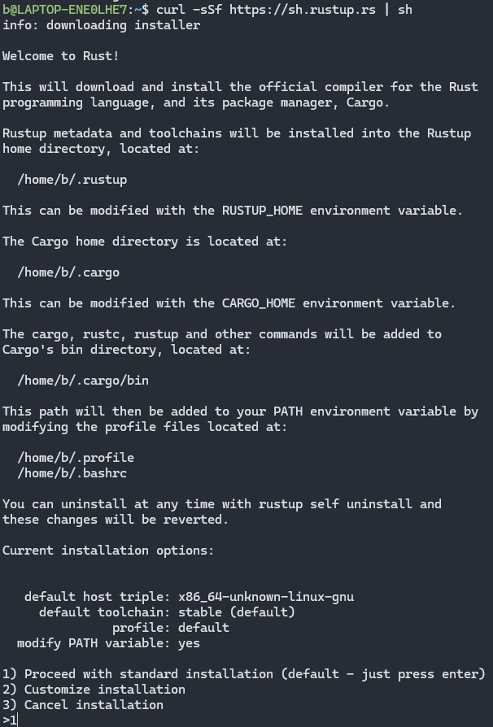
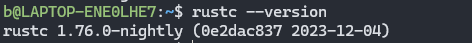
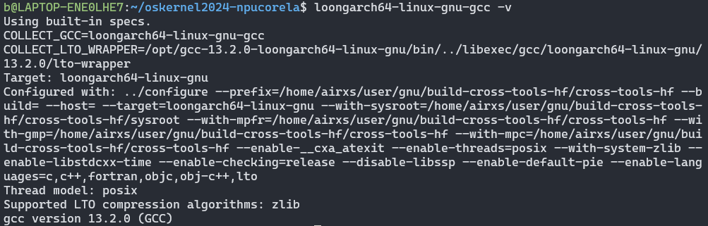
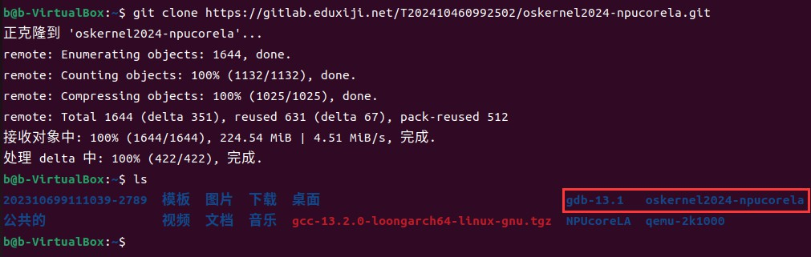
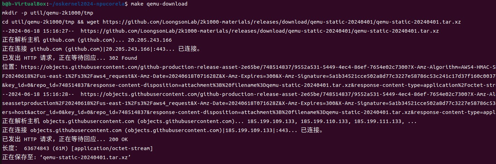
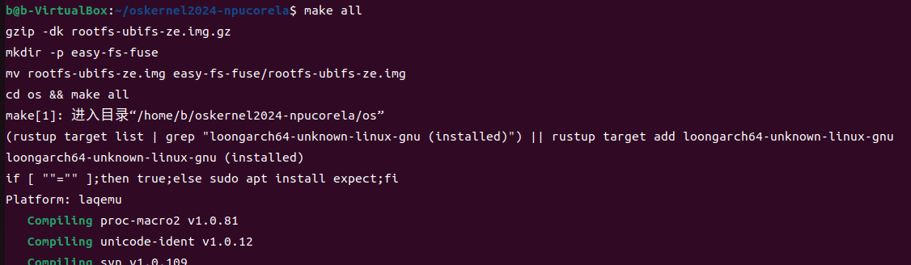
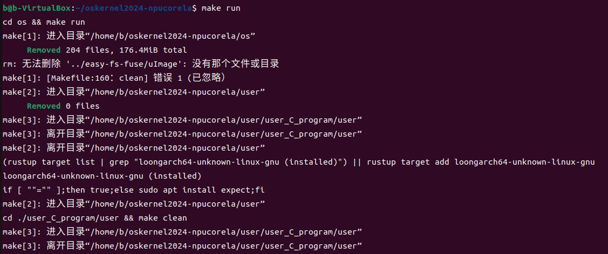
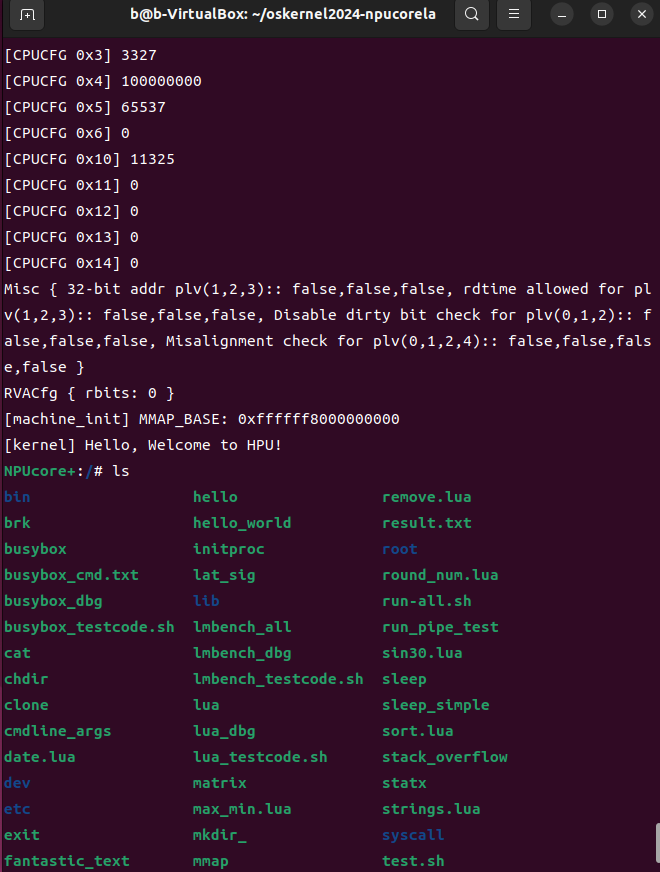

# **NPUcore+操作系统使用说明书**

## **一、系统运行环境**

### **1.1硬件环境**

处理器：AMD Ryzen 7 5800H with Radeon Graphics
内存容量：16GB
固态硬盘（SSD）：512GB
系统类型：Windows11 64 位操作系统

### **1.2环境准备与工具安装**

#### **1.2.1 Windows 11 VMware Workstation 安装Ubuntu22.04操作系统**

安装VMware Workstation 并在其中安装Ubuntu22.4操作系统：具体操作如下：

(1) 在[VMware Workstation](https://www.vmware.com)下载VMware并进行安装

(2)在开源网站中在线Ubuntu22.4的映像文件，并在VMware中利用该映像文件创建虚拟机，安装Ubuntu22.4操作系统

**注意：**这里只需要保证操作系统为 Ubuntu 22.04 即可，不强制要求必须使用 VMware  中的 Ubuntu 22.04。你也可以使用 WSL2或者 Oracle VM VirtualBox中的 Ubuntu 22.04 虚拟机。

#### **1.2.2基础编译包和工具安装**

打开安装好的 Ubuntu22.04，进入命令行界面，执行以下命令安装必备的编译工具包和库：

```shell
sudo apt-get install git build-essential gdb-multiarch qemu-system-misc libslirp-dev
```

继续在终端中执行以下命令来安装 Make：

```shell
sudo apt-get install make
```

接着安装 CMake：

```shell
sudo apt-get install cmake
```

#### **1.2.3 Rust 编译工具安装**

进入 Ubuntu22.04 命令行界面，安装 Rust 版本管理器 rustup 和 Rust 包管理器 Cargo，详细步骤如下。

首先，由于官方的脚本安装速度过慢，我们可修改 rustup 的镜像地址来加速，在命令行中依次输入下面两条命令，更换为中科大的源：

```shell
export RUSTUP_DIST_SERVER=https://mirrors.ustc.edu.cn/rust-static
export RUSTUP_UPDATE_ROOT=https://mirrors.ustc.edu.cn/rust-static/rustup
```

接着，安装 curl，在命令行中输入下面命令：

```shell
sudo apt-get install curl
```

然后，安装 Rust 版本管理器 rustup 和 Rust 包管理器 Cargo，在命令行中输入下面命令：

```shell
curl -sSf https://sh.rustup.rs | sh
```

默认的是 stable 版本，如图所示：



由于我们使用的是 nightly 版本，不是默认的 stable，可执行下面命令切换到 nightly 版本：

```shell
rustup default nightly
```

安装完成后，可以重新打开一个终端使新的环境变量生效。在终端中，输入以下命令来查看安装的 rustup 版本，以验证是否成功安装：

```shell
rustc –version
```

若出现 rustc 1.76.0-nightly 类似的输出说明安装正确，如下图所示：



下面通过上述步骤安装好的 rustup 和 cargo 来安装相关软件包。在命令行中键入下面命令，安装 loongarch64 标准库：

```shell
rustup target add loongarch64-unknown-linux-gnu
```

在命令行中键入下面命令，安装 loongarch64 的工具链：

```shell
rustup toolchain install stable-loongarch64-unknown-linux-gnu
```

在命令行中键入下面命令，安装 Cargo 工具：

```shell
cargo install cargo-binutils
```

在命令行中键入下面命令，安装 LLVM 工具：

```shell
rustup component add llvm-tools-preview
```

在命令行中键入下面命令，安装 Rust 源代码：

```shell
rustup component add rust-src
```

#### **1.2.4安装交叉编译工具**

本项目使用的为在 x86_64 下编译产生 loongarch64 的编译工具，LoongArch GCC 12 和 LoongArch GCC 13:

(1)LoongArch GCC 12 安装步骤
LoongArch GCC 12 百度网盘链接:https://pan.baidu.com/s/1xHriNdgcNzzn-X9U73sHlw 提取码:912v，需要再ubuntu22.04 的应用商店或者浏览器中搜索并下载百度网盘，接着下载百度网盘中的LoongArch GCC 12 压缩包，下载完成后，首先将本压缩包解压后，放至Ubuntu22.04 的/opt目录下；然后，将本文件夹引入环境变量，在~/.bashrc中添加环境变量:

通过vim ~/.bashrc命令打开配置文件（如果没有安装vim，可通过sudo apt-get install vim命令安装），在配置文件的最后一行添加下面内容：

```shell
export PATH="$PATH:/opt/cross-my/bin"
```

最后，执行如下命令来更新环境变量。

```shell
source ~/.bashrc
```

(2)LoongArch GCC 13 安装步骤
通过下面命令下载LoongArch GCC 13：

```shell
wget https://github.com/LoongsonLab/oscomp-toolchains-for-oskernel/releases/download/gcc-13.2.0-loongarch64/gcc-13.2.0-loongarch64-linux-gnu.tgz
```

通过下面命令，解压LoongArch GCC 13:

```shell
tar zxf gcc-13.2.0-loongarch64-linux-gnu.tgz
```

在~/.bashrc中增加交叉编译器路径，通过vim ~/.bashrc命令打开配置文件，在配置文件的最后一行添加下面内容：

```shell
export PATH=${PATH}:/opt/gcc-13.2.0-loongarch64-linux-gnu/bin
```

如果配置正确，输入“loongarch64-linux-gnu-gcc -v”命令后，会显示出详细的版本号，如图所示。



#### **1.2.5 安装编译 QEMU 源码所需的依赖包**

通过在命令行键入下面命令，安装相关依赖：

```shell
sudo apt install autoconf automake autotools-dev curl libmpc-dev libmpfr-dev libgmp-dev gawk build-essential bison flex texinfo gperf libtool patchutils bc zlib1gdev libexpat-dev pkg-config libglib2.0-dev libpixman-1-dev libsdl2-dev git tmux python3 python3-pip ninja-build
```


## **二、系统运行方式**

### **2.1** **获取项目代码文件**

**方式一（更推荐使用方式二获取）：**

与该说明书同目录下的 oskernel2024-npucorela-main.tar.gz 文件即为项目的代码文件，将其移动到 Ubuntu22.04 的用户目录下，使用 

```shell
tar -xvzf oskernel2024-npucorela-main.tar.gz 
```

命令解压缩即可。

请注意，从 Windows 移动文件到 Ubuntu 环境时，可能会出现字符编码不兼容的问题。Windows 的默认编码是 GBK，而 Linux 默认使用 UTF-8。如果在编译内核代码时因为换行符导致错误，可以通过以下步骤解决。首先，安装用于转换字符编码的 dos2unix 工具：`sudo apt install dos2unix`。然后，使用以下命令将出现错误的具体文件的字符编码转换为 UNIX 格式：`dos2unix filename`（其中 filename 是具体的文件名）。

**方式二：**

从gitlab仓库中拉取NPUcore+LA项目，仓库的地址为：https://gitlab.eduxiji.net/T202410460992502/oskernel2024-npucorela.git，进入Ubuntu22.01 命令行界面，通过下面命令拉取项目：

```shell
git clone https://gitlab.eduxiji.net/T202410460992502/oskernel2024-npucorela.git
```

如图所示，为成功拉取项目的结果，红框所框住的即为项目文件。



### **2.2 下载 QEMU-2K1000**

通过 cd 命令进入项目目录：

```shell
cd oskernel2024-npucorela
```

在 oskernel2024-npucorela 目录下运行下面命令下载 QEMU-2K1000，运行

结果如图所示：

```shell
make qemu-download
```



### **2.3 运行方式**

在 oskernel2024-npucorela 目录下通过 make all 命令编译内核，生成 os.bin文件，运行结果如图所示：

```shell
make all
```



在 oskernel2024-npucorela 目录下通过 make run 命令运行内核，进入命令行界面，运行结果如图所示：

```shell
make run
```



### **2.4 运行效果**

系统成功运行后，将进入命令行界面。输入 ls 命令后的结果如图所示。

```shell
ls
```



### **2.5 其他命令**

清理已经编译的项目（包括用户程序、系统和 FAT 镜像）：

```shell
make clean
```

缺少部分库文件和编译 rust 代码出现错误的问题，建议尝试 make clean 后，删除对应文件夹的 Cargo.lock，尝试在 Cargo.toml 中删除版本限制再重新编译。
