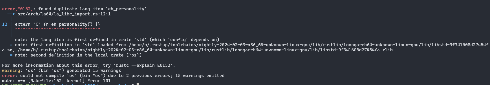
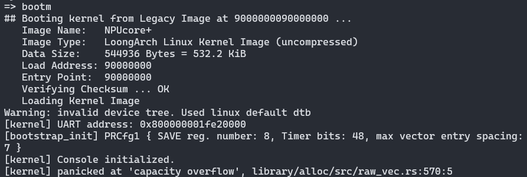
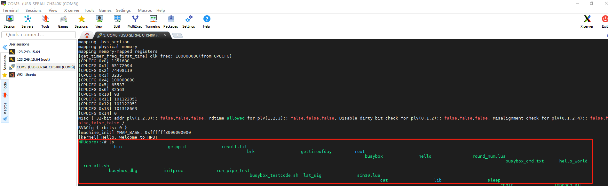

### 1.重复语言项错误

在将**arch/register**模块做成crate，并接入内核时出现下面报错：



**分析如下：**
**报错原因是出现了重复的语言项，内核中定义的`eh_personality`与标准库中的同名项产生冲突**

定义`eh_personality`的原因为内核通过panic_handler自定义了panic处理，而`panic_handler` 需要 `eh_personality` 语言项，但标准库已经定义了这个项。

**解决方法：**
在config.rs、register/lib.rs的顶层添加!#[no_std]，中不使用标准库中的定义的重名项。

### 2.capacity overflow



这个问题是由于没有正确适配测试平台qemu中load地址为0x9000000090000000，没有修改os/src/arch/la64/config.rs中的MEMORY_START地址。

``` rust
 // os/src/arch/la64/config.rs
 // pub const HIGH_BASE_ZERO: usize = 0x0000_0000_0000_0000;
 //pub const MEMORY_HIGH_BASE: usize = HIGH_BASE_ZERO;
 // pub const MEMORY_START: usize = MEMORY_HIGH_BASE; 由于加载地址之前为0x9000_0000_0000_0000，这里的MEMORY_START也是全零
pub const MEMORY_START: usize = 0x0000_0000_9000_0000;//适配qemu加载地址为0x9000_0000_9000_0000
```

### 3.上板ls命令输出乱

在龙芯2K1000开发板上使用ls命令，发现输出不对齐。串口输出的bug，需要再换行符后加一个回车




``` rust
    fn write(&mut self, word: u8) -> nb::Result<(), Self::Error> {
        unsafe { write_volatile((self.base + offsets::THR) as *mut u8, word) };
        if word == b'\n' { 
            // 如果写入的字节是换行符，那么除了写入换行符之外，还需额外写入一个回车符 
            unsafe { write_volatile((self.base + offsets::THR) as *mut u8, b'\r') }; 
            } 
        Ok(())
    }
```

在某些终端或设备上，只写入换行符可能不会导致光标正确地移动到下一行的开始位置。当写入换行符时，也会自动写入一个回车符，以确保在终端或设备上的正确显示。
