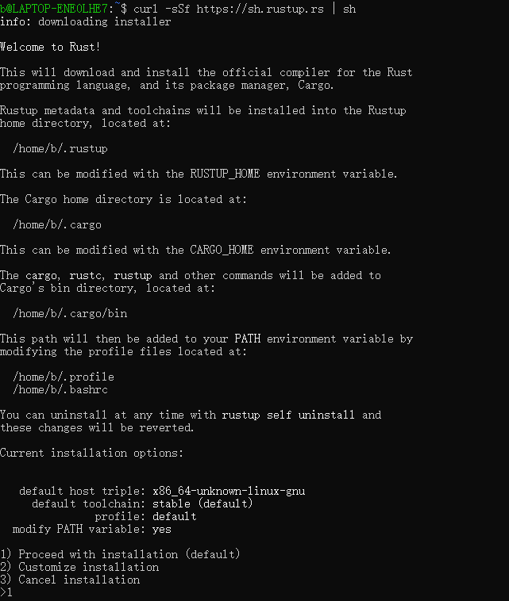
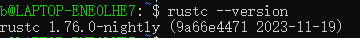
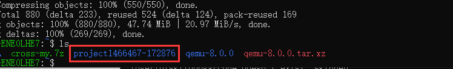
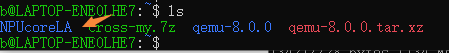
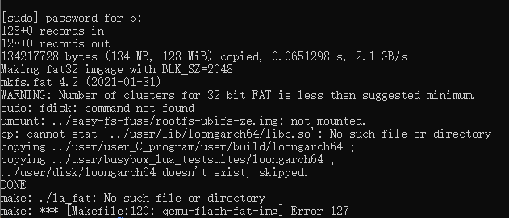
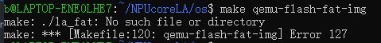
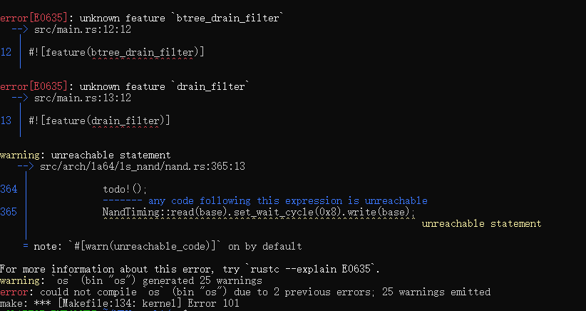
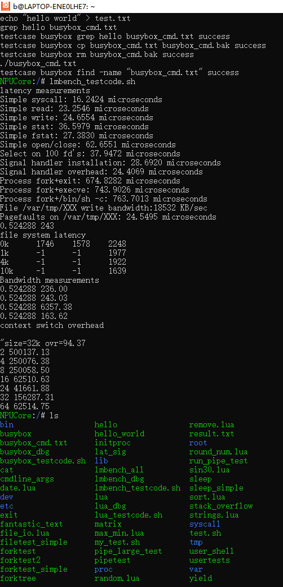

## QEMU运行NPUcoreLA

### **1.Rust**编译⼯具安装

#### 1.1 ⼀些基础编译包和工具的安装：

```bash
sudo apt-get install git build-essential gdb-multiarch qemu-system-misc libslirp-dev
```

#### 1.2 make、Cmake安装（辅助编译工具） ：

``` bash
sudo apt-get install make
sudo apt-get install cmake
```

#### 1.3 安装Rust版本管理器rustup和Rust包管理器Cargo：

``` bash
curl -sSf https://sh.rustup.rs | sh
```

**安装时注意选择nigthly版本**，默认的是stable版本。

如果没有curl，请先安装curl：**sudo apt-get install curl**



如果默认选择了stable版本，可执行下面命令切换到nightly版本

``` bash
rustup default nightly
```

 安装完成后，记得**重新打开⼀个终端**使新的环境变量⽣效。在新终端中，输⼊以下命令来查看安装的

rustup的版本，以验证是否成功安装：

``` bash
rustc --version
```

若出现类似下⾯的输出，即代表安装成功：



安装完成后，我们需要**重新打开⼀个终端**来让之前设置的环境变量⽣效。

下⾯利⽤上⾯步骤安装号的rustup和cargo来安装Rust相关软件包

``` bash
# 安装loongarch64标准库
rustup target add loongarch64-unknown-linux-gnu
# 安装loongarch64的工具链
rustup toolchain install stable-loongarch64-unknown-linux-gnu

cargo install cargo-binutils
rustup component add llvm-tools-preview
rustup component add rust-src
```

安装交叉编译工具。本项目使用的为在x86_64下编译产生loongarch64的编译工具，LoongArch GCC 12:

百度网盘链接: https://pan.baidu.com/s/1xHriNdgcNzzn-X9U73sHlw 提取码: 912v

下载完成后，首先将本压缩包解压后，放至`/opt`目录下; 然后，将本文件夹引入环境变量，在`~/.bashrc`中添加

``` bash
export PATH="$PATH:/opt/cross-my/bin"
```

最后，执行如下命令来更新环境变量。

```shell
source ~/.bashrc
```

### 2.QEMU安装

#### 2.1 安装编译QEMU源码所需的依赖包

``` bash
sudo apt install autoconf automake autotools-dev curl libmpc-dev libmpfr-dev libgmp-dev \
              gawk build-essential bison flex texinfo gperf libtool patchutils bc \
              zlib1g-dev libexpat-dev pkg-config  libglib2.0-dev libpixman-1-dev libsdl2-dev \
              git tmux python3 python3-pip ninja-build
```

#### 2.2 下载Qemu 源码

``` bash
wget https://download.qemu.org/qemu-8.0.0.tar.xz
```

#### 2.3 解压

``` bash
tar xvJf qemu-8.0.0.tar.xz
```

#### 2.4 编译QEMU源码，⽣成可运⾏的QEMU软件

``` bash
cd qemu-8.0.0 // 打开解压后的⽂件夹
mkdir build  //新建一个文件夹用于存放编译产生的文件
cd build
../configure  --enable-slirp --target-list=loongarch64-linux-user,loongarch64-softmmu --prefix=/opt/qemu-8.0
make -j8
sudo make install
```

#### 2.5 配置环境变量，使你能在任意位置直接运⾏QEMU

``` bash
vim ~/.bashrc
export PATH=/opt/qemu-8.0/bin:$PATH
source ~/.bashrc   #一定要记得刷新环境变量
```

可通过下面步骤检验是否成功安装支持LoongArch架构的QEMU：

``` bash
$ qemu-system-loongarch64 --version
QEMU emulator version 7.2.0
Copyright (c) 2003-2022 Fabrice Bellard and the QEMU Project developers

$ qemu-system-loongarch64 -M ?
Supported machines are:
none                 empty machine
virt                 Loongson-3A5000 LS7A1000 machine (default)

$ qemu-system-loongarch64 -cpu ?
la464-loongarch-cpu
```

若出现类似上面的输出，即代表QEMU安装成功。

### **3.QEMU**上运⾏**NPUcore**内核

#### 3.1 拉取NPUcore+LA项目到本地

从仓库中拉取NPUcore+LA项目，仓库地址：https://gitlab.eduxiji.net/202310699111039/project1466467-172876

``` bash
git clone https://gitlab.eduxiji.net/202310699111039/project1466467-172876.git
```



上图红框中的project1466467-172876就是我们拉取下来的项目了，由于文件名字太长，下面通过mv命令，将文件名字改成NPUcoreLA:

``` bash
mv project1466467-172876 NPUcoreLA
```



上图的NPUcoreLA便是我们的项目目录了。

#### 3.2 运行方式与运行效果

``` bash
cd NPUcoreLA
cd os && make
```

遇到的第一个报错：



这个错误似乎表明在制作镜像或者在执行特定的脚本时出现了问题。

**文件系统编译：**

`make fat32`: 创建文件系统镜像， 但不刷入虚拟机 

`make qemu-flash-fat-img`: 创建文件系统镜像， 且入虚拟机

执行下面命令：

``` bash
make fat32
make qemu-flash-fat-img
```

遇到了第二个报错：



这个错误是因为os/la_fat文件开头为#!/usr/bin/expect -f 需要安装expect:

``` bash
sudo apt-get install expect
```

重新执行下面命令：

``` bash
make qemu-flash-fat-img
make
```

遇到了第三报错：



打开报错文件：

``` bash
vim ./src/main.rs
```

将报错的#![feature(btree_drain_filter)]和#![feature(drain_filter)]注释掉：


重新执行：

```bash
make
```



成功启动NPUcore。

### .vscode中launch.json配置

```json
{
    "version": "0.2.0",
    "configurations": [
     {
    "type": "cppdbg",
    "request": "launch",
    "name": "Attach to gdbserver",
    "program": "${workspaceRoot}/os/target/loongarch64-unknown-linux-gnu/debug/os",
    "miDebuggerServerAddress": "localhost:1234",
    "miDebuggerPath": "loongarch64-unknown-linux-gnu-gdb",
    "cwd": "${workspaceRoot}/os"
     }
     ]
}
```


