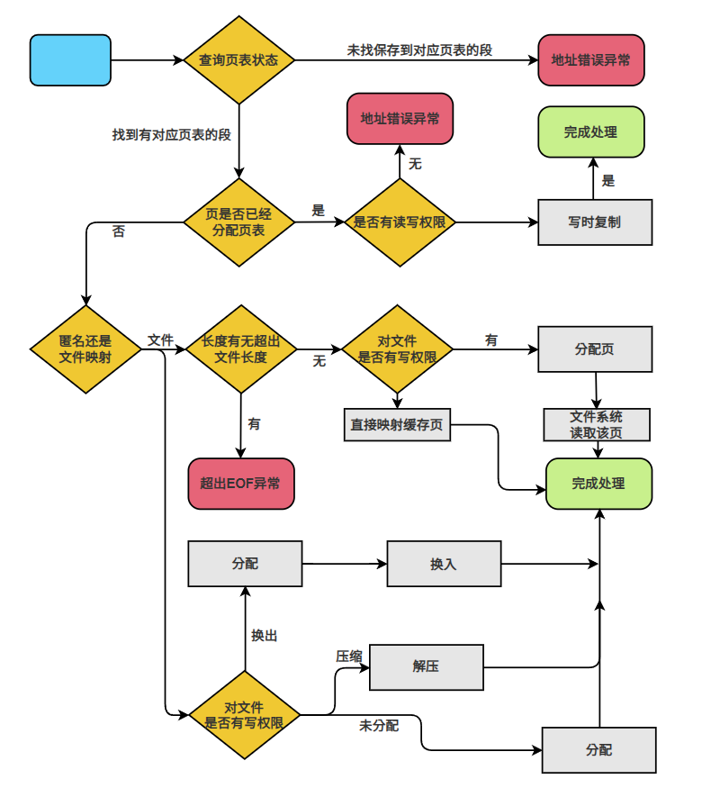

#### **1.1** 内存管理

如下图所示，这是 NPUcoreLA 的内存管理模块结构图。NPUcoreLA 的物理内存分配方式包括栈式内存管理、物理页帧的分配与回收。物理内存的具体分配由物理内存分配器完成。在分配物理内存时，分配器根据页面大小和页面置换算法，决定哪些页面需要被替换，并将新页面分配到内存池中。

Page_Table.rs 文件中实现了 print_page_table 函数，用于输出页表信息。该函数以 root_ppn 为起点，逐层进行索引，通过 get_pte_array 函数获取每一层的页表项数组。对于每一层中的每个表项，函数首先判断其是否有效。如果表项无效，序号会自动递增，并继续遍历下一个表项；如果表项有效，函数则会打印页表及其对应的物理地址，同时序号也会递增。

##### 1.1.1 物理内存管理

物理内存管理是操作系统的核心部分之一。为了提高系统对物理内存的动态使用效率，隔离各应用的物理内存空间以保证应用间的安全性，我们对硬件层面的物理内存空间进行了一层抽象，建立了虚拟地址空间到物理内存空间的映射。从此，每个应用程序都享有独属于自己的，且足够庞大(一般来说)的存储空间，而不用与其他应用程序“抢占”资源。而将每个应用的逻辑地址空间分配到实际的物理内存空间这一任务，正是由操作系统来负责。

根据页式管理的知识，我们将虚拟地址和物理地址均分成两部分：它们的低 12位，即 \[11:0\] 被称为页内偏移 (Page Offset)，它描述一个地址指向的字节在其所在页面中的相对位置。在 SV39 分页模式下，我们规定虚拟地址一共 39 位，则虚拟地址的高 27 位，即 [38:12\] 为它的虚拟页号 VPN (Virtual Page Number)；我们规定物理地址一共56 位，则物理地址的高 44 位，即 \[55:12\] 为它的物理页号 PPN (Physical Page Number)。

>  

我们实现地址信息类型与 usize类型的相互转换，我们已经实现了多级页表的分页管理机制，大大简化了物理内存分配的复杂度，每次分配和回收都以一个页面为单位，新建进程时地址空间为空，没有对应的物理页面的。随着进程的不断运行，逐渐申请物理页面，所占的物理内存不断增加。这就要求内核要给用户进程提供物理内存分配的功能。因此，我们需要通过以下几个方面来学习如何实现物理内存页面的分配管理。

1.  划分内核在不同平台的可动态分配的物理地址空间范围。

2.  实现物理页面的 RAII
    特性，即生命周期随着页面的申请而分配，随着进程结束而释放。

3.  实现栈式的物理内存分配管理，通过栈的维护来管理空闲的物理页面，实现分配时从栈顶弹出，回收时压栈的效果。

4.  向用户进程提供申请和释放物理页面的接口方法。

>  

##### 1.1.2 虚拟内存管理

内存管理，是指软件运行时对电脑内存资源的分配和使用的技术。其最主要的目的是如何高效、快速的分配，并且在适当的时候释放和回收内存资源。

NPUcoreLA实现了一种依赖 Page Fault 的优化（CoW）。通过将两个页表项的 W 权限位清零, 并且映射到相同的物理页。可以实现页面共享和写时复制（CopyonWrite）。对共享页的写入会产生 Page Fault,
此时我们再结合内存描述符以及页表项的情况做出判断和相应处理。

如图所示，是我们对相关 Fault 具体的处理方法：

>  

其次是 Page Fault。由于没有权限的情况判断已经由之前的两个路径分支点完成,这里一定是有权限的, 只是触发的权限是 Read 还是 Write。进入这个分支的必然是页还没分配的, 如果是文件映射，对于 MapArea 中有写入权限的, 按照 Linux 的默认行为, 是直接写回文件, 所以我们直接将页分配给这里, 然后读取一页的文件即可。对于文件没有写入权限的, 就可以直接映射已经缓存的页, 然后完成。之后的其他行为和别的已经映射的没有差异。事实上, Linux 是允许阻断文件映射对源文件的写回, 但不是默认行为, 我们暂时不考虑。如果是匿名映射，则需要进行判断，如果该页面未被分配，则分配页面；如果是该页面已分配但是已被换出，则重新进行分配，即将该页面重新换入；如果该页面处于压缩内存当中，则将该页面进行解压，得到原来的页面，经过上述三种不同情况的处理，就可完成分配。

NPUcoreLA的“扩容”集成优化方法，效果极其显著。这一套虚拟内存管理方法，让应用程序可以感知到更多的可用内存，我们的实验也验证了NPUcoreLA 内存回收性能的高效。
