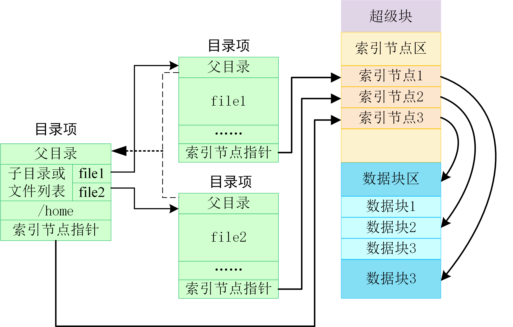

#### **1.1** 文件系统

NPUCoreLA 中具体实现方式是通过文件目录树来实现的，目录树 (Directory Tree) 的有根树数据结构如下所示

NPUcoreLA 中数据结构之间的联系如下图所示

##### 1.1.1 文件系统概述

文件最早来自于计算机用户需要把数据持久保存在持久存储设备上的需求。由于放在内存中的数据在计算机关机或掉电后就会消失，所以应用程序要把内存中需要保存的数据放到持久存储设备的数据块（比如磁盘的扇区等）中存起来。随着操作系统功能的增强，在操作系统的管理下，应用程序不用理解持久存储设备的硬件细节，而只需对文件这种持久存储数据的抽象进行读写就可以了，由操作系统中的文件系统和存储设备驱动程序一起来完成繁琐的持久存储设备的管理与读写。所以本章要完成的操作系统的第一个核心目标是：让应用能够方便地把数据持久保存起来。

对于应用程序访问持久存储设备的需求，内核需要新增两种文件：常规文件和目录文件，它们均以文件系统所维护的磁盘文件形式被组织并保存在持久存储设备上。

##### 1.1.2 虚拟文件系统及接口

虚拟文件系统（Virtual File System，简称 VFS）也可称为虚拟文件转换，是一个内核软件层，用来处理与 Unix
标准文件系统相关的所有系统调用。它为用户程序提供文件和文件系统操作的统一接口，屏蔽不同文件系统的差异和操作细节。借助 VFS 可以直接使用 open()、read()、write() 这样的系统调用操作文件，而无须考虑具体的文件系统和实际的存储介质，极大简化了用户访问不同文件系统的过程。另一方面，新的文件系统、新类型的存储介质，可以无须编译的情况下，动态加载到内核中。

>  

VFS 的思想是把不同类型文件的共同信息放入内核，具体思路是通过在用户进程和文件系统之间引入了一个抽象层。用户可以通过这个抽象层的接口自由使用不同的文件系统，而新的文件系统只需要支持这些接口就能直接加载到内核中使用。

>  