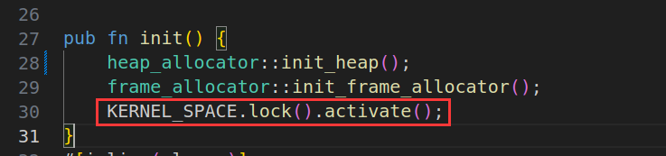

### 1.1 实现第一个系统调用mycall

首先需要在NPUcore的user目录下创建对应的mycall.rs文件，vim /oskernel2022-npucore/user/src/bin/mycall.rs:

``` rust
#![no_std]
#![no_main]

#[macro_use]
extern crate user_lib;
use user_lib::mycall;

#[no_mangle]
pub fn main() -> i32 {
    mycall();
    0
}
```

接下来是增加下面对应的代码：

用户态：

- user/src/syscall.rs，76行，153行
- user/src/usr_call.rs，58行

内核态：

- os/src/syscall/mod.rs，97行，441行

- os/src/syscall/process.rs，1030行    

  **1.user/src/syscall.rs,76行，153行 ：**

``` rust
const SYSCALL_MYCALL: usize = 6666;   //76行

pub fn sys_mycall() -> isize {		 //153行
    syscall(SYSCALL_MYCALL,[0,0,0])
}
```

2. **user/src/usr_call.rs，58行**

``` rust
pub fn mycall() -> isize {
    sys_mycall()
}
```

3. **os/src/syscall/mod.rs，97行，441行**

 ``` rust
const SYSCALL_MYCALL: usize = 6666; //97行
SYSCALL_MYCALL => sys_mycall(),     //441行
 ```

   4.**os/src/syscall/process.rs，1030行**  

``` rust
pub fn sys_mycall() -> isize {
    let string = "362009baozixu\n";
    for ch in string.chars(){
      sbi_call(SBI_CONSOLE_PUTCHAR, ch as usize, 0, 0);
    }
    0
}
```

make run 后出现报错，原因是无法访问/os/src/sbi.rs文件中的SBI_CONSOLE_PUTCHAR和 sbi_call因为他们是私有的，只需在前面增加pub即可：

``` rust
pub const SBI_CONSOLE_PUTCHAR: usize = 1;
pub fn sbi_call(which: usize, arg0: usize, arg1: usize, arg2: usize) -> usize {
```

make clean 

make run 后process.rs再次出现报错，原因是没有导入sbi的相关模块：

``` rust
use crate::sbi::console_putchar;
use crate::sbi::SBI_CONSOLE_PUTCHAR;
use crate::sbi::sbi_call;
```

至此，可在头歌平台完成mycall的实验内容。


rustup在头歌平台编译时速度受限，可通过更换国内源的方式解决，这里使用的是中科大的源：

``` rust
export RUSTUP_DIST_SERVER=https://mirrors.ustc.edu.cn/rust-static
export RUSTUP_UPDATE_ROOT=https://mirrors.ustc.edu.cn/rust-static/rustup
```

***

由于头歌平台使用体验感不好，准备在本地配置一下环境，在本地环境上实现mycall时出现了问题：

``` bash
NPUCore:/# mycall
bash: mycall: command not found
```

我首先考虑的是可能我的mycall.rs没有被正确的编译并生成对应的可执行文件mycall。

查看了user/目录下的所有文件后，发现在**/user/target/riscv64gc-unknown-none-elf/release**目录下是存放编译好的可执行文件和中间文件的地方：


因为在user/src/bin这个目录下的用户代码只有两个分别是：initproc.rs和mycall.rs，而在/user/target/riscv64gc-unknown-none-elf/release目录下有initproc的可执行文件，却没有mycall的可执行文件，可以证实我前面的猜测是对的，我的mycall.rs没有被正确的编译。


然后我分别阅读了一下user/Makefile以及os/Makefile

``` makefile
#user/Makefile
TARGET := riscv64gc-unknown-none-elf

build: rust-user

rust-user: $(APPS)
	rustup target add $(TARGET)
	@cargo build --release

clean:
	@cargo clean

.PHONY: build rust-user clean
```

``` makefile
# os/Makefile 中部分相关的代码
 ... 
APPS := ../user/src/bin/*
 ...
 
fat32:
	./buildfs.sh "$(U_FAT32_DIR)/fat32.img"
	
# build all user programs
user:
	@cd ../user && make
c-user:
	@cd ../user && make c-user
rust-user:
	@cd ../user && make rust-user
```

发现这两个Makefile文件并没有什么问题，于是我手动在/user执行了一下make、c-user、rust-user，终于在/user/target/riscv64gc-unknown-none-elf/release目录中生成了mycall可执行文件：


于是我重新在/os目录下make run，结果还是不行，还是出现：bash: mycall: command not found的报错，于是我推测是因为FAT32 文件系统镜像没有更新，于是我在os/目录下执行make fat32，重新创建模拟器的FAT32 文件系统镜像作为程序运行所需的模拟存储介质：


在/os目录下make  clean、make  run，并且输入mycall后成功打印出学号和姓名：


***


### 2.1 打印内核⻚表

1. os/src/main.rs
2. os/src/mm/mod.rs
3. os/src/mm/page_table.rs
4. os/src/mm/memory_set.rs

首先观察main.rs中的主函数入口，发现和mm有关的有mm::init();和mm:remap_test();首先进入init()函数:


在mod.rs中找到init()函数的定义，init_heap主要和堆的初始化相关，init_fram_allocator主要和栈式物理页帧管理器的初始化有关,除此之外，发现了一个极为重要的全局宏:KERNEL_SPACE,通过查找KERNEL_SPACE，发现在memory_set.rs中KERNEL_SPACE会调用new_kernel函数创建一个新的内核空间，并调用activate函数启用我们的虚拟内存，完成内核空间初始化。所以我们要想打印内核页表，应该选择在我们的内核空间初始化完之后进行页表打印，也就是在new_kernel函数的最后调用相关函数打印出所有的页表。



因为要打印内核页表，所以我在Page_Table中实现了一个print_page_table函数，根据root_ppn,逐层向内进行索引，并通过get_pte_array函数获取页表项数组，对于每一层的每一个表项，首先判断他是否有效。如果无效会将当前表项的序号进行自增；如果该表项有效，我们则会按照要求打印出页表和物理地址，并将当前页表项的序号自增。

``` rust
//page_table.rs
//impl PageTable {}方法中定义print_page_table函数
pub fn print_page_table(&self){
        let mut ppn = self.root_ppn;
        let mut pa:PhysAddr = ppn.into();
        println!("page table:{:#x}",pa.0);
        let mut number_zero = 0;
        let mut number_one = 0;
        let mut number_two = 0;        
        for pte_zero in ppn.get_pte_array(){   //get_pte_array函数用于获取页表项数组
            if !pte_zero.is_valid(){
                number_zero += 1;
                //continue;
                break; //使用continue会导致打印过长
            }
            ppn = pte_zero.ppn();
            let mut pa_zero:PhysAddr = ppn.into();
            println!("..{}: pte 0x{:016x} pa 0x{:016x}",number_zero,pte_zero.bits,pa_zero.0);
            number_zero += 1;

            for pte_one in ppn.get_pte_array(){
                if !pte_one.is_valid(){
                    number_one += 1;
                   continue;
                }
                ppn = pte_one.ppn();
                let mut pa_one:PhysAddr = ppn.into();
                println!(".. ..{}: pte 0x{:016x} pa 0x{:016x}",number_one,pte_one.bits,pa_one.0); 
                number_one += 1;

                for pte_two in ppn.get_pte_array(){
                   
                    if !pte_two.is_valid(){
                        number_two += 1;
                        continue;
                    }
                    ppn = pte_two.ppn();
                    let mut pa_two:PhysAddr = ppn.into();
                    println!(".. .. ..{}: 0x{:016x} pa 0x{:016x}",number_two,pte_two.bits,pa_two.0); 
                    number_two += 1;
                }
            }
        }
        println!("printf page table compete!!!");
    } 
```

在memory_set.rs中调用print_page_table函数，首先通过 let mut memory_set = Self::new_bare()发现memory的结构体中包含PageTable，也就意味着可以通过memory_set调用我们写在PageTable中的print_page_table函数，实现打印页表：

``` rust
    pub fn new_kernel() -> Self {
        let mut memory_set = Self::new_bare();
        // map trampoline
        memory_set.map_trampoline();
        // map kernel sections
        println!(".text [{:#x}, {:#x})", stext as usize, etext as usize);
        println!(".rodata [{:#x}, {:#x})", srodata as usize, erodata as usize);
        println!(".data [{:#x}, {:#x})", sdata as usize, edata as usize);
        println!(
            ".bss [{:#x}, {:#x})",
            sbss_with_stack as usize, ebss as usize
        );
        macro_rules! anonymous_identical_map {
            ($begin:expr,$end:expr,$permission:expr) => {
                memory_set
                    .push(
                        MapArea::new(
                            ($begin as usize).into(),
                            ($end as usize).into(),
                            MapType::Identical,
                            $permission,
                            None,
                        ),
                        None,
                    )
                    .unwrap();
            };
            ($name:literal,$begin:expr,$end:expr,$permission:expr) => {
                println!("mapping {}", $name);
                anonymous_identical_map!($begin, $end, $permission);
            };
        }
        anonymous_identical_map!(
            ".text section",
            stext,
            etext,
            MapPermission::R | MapPermission::X
        );
        anonymous_identical_map!(".rodata section", srodata, erodata, MapPermission::R); // read only section
        anonymous_identical_map!(
            ".data section",
            sdata,
            edata,
            MapPermission::R | MapPermission::W
        );
        anonymous_identical_map!(
            ".bss section",
            sbss_with_stack,
            ebss,
            MapPermission::R | MapPermission::W
        );
        anonymous_identical_map!(
            "physical memory",
            ekernel,
            MEMORY_END,
            MapPermission::R | MapPermission::W
        );

        println!("mapping memory-mapped registers");
        for pair in MMIO {
            anonymous_identical_map!(
                (*pair).0,
                ((*pair).0 + (*pair).1),
                MapPermission::R | MapPermission::W
            );
        }
 //实现对print_page_table函数的调用，print_page_table属于PageTable，所以要记得 memory_set.page_table
 // let mmemory_set = Self::new_bare(); 可通过new_bare()看到mmemory_set的属性包含PageTable
        memory_set.page_table.print_page_table(); 
        memory_set
    }
```


### 2.2 实现sbrk系统调用

补全 memory_set.rs ⽂件第 797 ⾏的 sbrk 函数

实现 sbrk 系统调⽤

刚开始看的这个的时候不知道该如何下手去实现这个系统调用，只知道要根据increment的正负，通过调用mmap和munmap修改堆的大小，并返回堆顶指针：

``` rust
pub fn sbrk(&mut self, heap_pt: usize, heap_bottom: usize, increment: isize) -> usize {
        // TODO: 在此处填充代码实现 sbrk
        if increment > 0 {
			//判断新的栈顶指针是否合法
            //不合法返回报错信息
            }else {
			//合法调用mmap扩张堆空间
        	//返回新的栈顶指针
            }
        }else if increment <0 {
			//判断新的栈顶指针是否合法
            //不合法返回报错信息
            }else {
			//合法调用munmap收缩堆空间
        	//返回新的栈顶指针
        }
        return new_pt;
    }
```

因为我git clone下来的NPUcore仓库发现在 memory_set.rs中已经实现了sbrk函数，通过看NPUcore源码中的sbrk后大致了解了该怎么去写，同时也发现了NPUcore实现的sbrk有一点小问题,下面是NPUcore实现的sbrk：

问题1：  let new_pt: usize = old_pt + increment as usize;因为new_pt是最后要返回的栈顶指针地址，这里increment是isize类型的，当increment<0时，将increment强制转换成usize会导致地址错误，不能正确得到堆顶指针的地址。应该先将old_pt：usize转换成old_pt：isize，然后与increment相加，再转换成usize才可以正确得到new_pt,即：**let new_pt = (heap_pt as isize + increment) as usize;** 

问题2：self.munmap(old_pt, increment as usize).unwrap();这里当increment<0时，很明显会出现错误， 因为pub fn munmap(&mut self, start: usize, len: usize) ，第二个参数传递的是缩减的大小，这里将一个负数转换成无符号数会导致传入的 increment as usize过大，并且也不是正确的len，会导致下面的报错：，因为increment<0，所以应该先将increment转换成有符号整数然后在转换成usize，即(-increment) as usize)：

``` rust
  //有bug的sbrk
pub fn sbrk(&mut self, heap_pt: usize, heap_bottom: usize, increment: isize) -> usize {
        let old_pt: usize = heap_pt;
        let new_pt: usize = old_pt + increment as usize;  //问题1：这里increment是isize类型的，当increment为负时，会导致计算出错
        if increment > 0 {
            let limit = heap_bottom + USER_HEAP_SIZE;
            if new_pt > limit {
                warn!(
                    "[sbrk] out of the upperbound! upperbound: {:X}, old_pt: {:X}, new_pt: {:X}",
                    limit, old_pt, new_pt
                );
                return old_pt;
            } else {
                self.mmap(
                    old_pt,
                    increment as usize,
                    MapPermission::R | MapPermission::W | MapPermission::U,
                    MapFlags::MAP_ANONYMOUS | MapFlags::MAP_FIXED | MapFlags::MAP_PRIVATE,
                    1usize.wrapping_neg(),
                    0,
                );
                trace!("[sbrk] heap area expanded to {:X}", new_pt);
            }
        } else if increment < 0 {
            if new_pt <= heap_bottom {
                warn!(
                    "[sbrk] out of the lowerbound! lowerbound: {:X}, old_pt: {:X}, new_pt: {:X}",
                    heap_bottom, old_pt, new_pt
                );
                return old_pt;
            } else {
                self.munmap(old_pt, increment as usize).unwrap(); //问题2： increment as usize 这里直接将isize转换成usize是错误的
                trace!("[sbrk] heap area shrinked to {:X}", new_pt);
            }
        }
        new_pt
    }
```

问题2出错是因为传进munmap的len参数过大，下面分析一下出错过程：

``` rust
 pub fn munmap(&mut self, start: usize, len: usize) -> Result<(), isize> {
      let end_va = VirtAddr::from(start + len); //len参数过大
      let end_vpn = end_va.ceil();
      let mut found_area = false;  //初始为false
      self.areas.iter_mut().enumerate().for_each(|(idx, area)| {
            if let Some((overlap_start, overlap_end)) = area.check_overlapping(start_vpn, end_vpn) {
                //end_va过大，不在check_overlapping范围内，不会进入if语句
                found_area = true;  //不会执行这条代码
                ...
          		}
            } else {
                    trace!("[munmap] unmap internal part, call into_three");
                    break_apart_idx = Some(idx);
                }
        }
          ...
        if found_area {   //found_area始终为false
            Ok(())
        } else {
            Err(EINVAL)   //出现报错
        }
//errno.rs        
/// Invalid argument
pub const EINVAL: isize = -22;
```

下面是修改后正确的sbrk函数：

``` rust
 //正确的sbrk    
pub fn sbrk(&mut self, heap_pt: usize, heap_bottom: usize, increment: isize) -> usize {
        // TODO: 在此处填充代码实现 sbrk
        let old_pt = heap_pt;
        let new_pt = (heap_pt as isize + increment) as usize; //修改
        if increment > 0 {
            if new_pt > heap_pt + USER_HEAP_SIZE {
                warn!("increment too big");
                return old_pt;
            }else {
                self.mmap(
                    old_pt,
                    increment as usize,
                    MapPermission::R | MapPermission::W | MapPermission::U,
                    MapFlags::MAP_ANONYMOUS | MapFlags::MAP_FIXED | MapFlags::MAP_PRIVATE,
                    0,
                    0
                );
          //      return new_pt;
            }
        }else if increment <0 {
            if new_pt < heap_bottom{
                warn!("increment too small");
                return old_pt;
            }else {
                self.munmap(old_pt,(-increment) as usize).unwrap(); //修改
               // return new_pt;
            }
        }
        return new_pt;
    }
  
```

### 2.3 实现**mmap**系统调⽤的**MAP_ANONYMOUS**

首先根据提示实现缺失的两个条件，第一个条件判断区域权限与参数中指定权限相同：`area` 是对 `MapArea` 结构体实例的一个引用，可以用来访问和修改 `MapArea` 实例中的数据,pub struct MapArea { inner: LinearMap,map_type: MapType,**map_perm: MapPermission**,pub **map_file: Option<Arc<dyn File>>**,}可看到其中的map_prem字段的类型是MapPermission，和mmap中的prot字段的类型相同，所以我们可以写出第一个判断条件为：`area.map_perm == prot`。

第二个判断条件是判断区域 map_file 为空,由于map_file是`Option` 类型，所以可以使用Option类型的一个方法叫做 `is_none()`来判断是否为空，即：`area.map_file.is_none()`。

接下来是实现 mmap 系统调用的 MAP_ANONYMOUS，mmap 匿名映射的作⽤是在进程空间中创建⼀段指定⼤⼩的虚拟内存区域，该区域不与任何实际⽂件关联，也不会被写⼊硬盘。根据上面的提示`[mmap] merge with previous area, call expand_to`,可知道可以通过调用expand_to()函数来实现mmap的 匿名映射。查看expand_to函数：

``` rust
  //expand_to函数的主要作用是根据传入的新的结束虚拟地址，更新数据结构中的结束虚拟页号，从而实现扩张
pub fn expand_to(&mut self, new_end: VirtAddr) -> Result<(), ()> {
        let new_end_vpn: VirtPageNum = new_end.ceil();
        let old_end_vpn = self.inner.vpn_range.get_end();
        if new_end_vpn < old_end_vpn {
            warn!(
                "[expand_to] new_end_vpn: {:?} is lower than old_end_vpn: {:?}",
                new_end_vpn, old_end_vpn
            );
            return Err(());
        }
        // `set_end` must be done before calling `map_one`
        // because `map_one` will insert frames into `data_frames`
        // if we don't `set_end` in advance, this insertion is out of bound
        self.inner.set_end(new_end_vpn)?;
        Ok(())
    }
```

可知道expand_to函数函数用于将数据结构的内存范围扩展到给定的虚拟地址，确保新范围不小于旧范围。所以我们只需要将mmap中的扩展后的地址传入expand_to函数中即可，首先需要计算出新的扩展地址，首先需要获得当前区域的结束虚拟地址，可以借鉴expand_to函数中self.inner.vpn_range.get_end（）的写法来获取当前区域的结束虚拟页号，然后在使用into()转换成虚拟地址，即let  end_va : VirtAddr= area.inner.vpn_range.get_end().into(); 接着可通过VirtAddr::from(end_va.0 + len))得到扩展后的虚拟内存地址，注意这里由于end_va是 VirtAddr类型，len是usize类型，这里没有实现VirtAddr和VirtAddr相加的trait，所以只能通过usize+usize相加然后在转换成VirtAddr实现，这里end_va.0就已经是usize类型的了,·`pub struct VirtAddr(pub usize);`由于 `VirtAddr` 结构体定义中的唯一字段是 `usize` 类型的公共字段 `pub usize`，因此在这里 `.0` 表示访问该结构体实例中的 `usize` 类型字段。接着通过area调用expand_to函数，即：area.expand_to(VirtAddr::from(end_va.0 + len)).unwrap();因为expand_to函数返回类型是Result<(), ()> 这里通过调用unwrap来防止expand_to函数中的新的结束地址小于旧的结束地址的错误。由于mmap的返回类型是isize，我们要在调用expand_to函数完成扩展后，返回旧的结束地址，即return end_va.0 as isize。

``` rust
    pub fn mmap(
        &mut self,
        start: usize, 	//要映射的地址空间区域的开始地址
        len: usize,		//该区域的⼤⼩
        prot: MapPermission, //该区域的访问权限
        flags: MapFlags, // 映射的⽅式 (如读写权限等)
        fd: usize,       //要映射的⽂件的句柄 (⽂件描述符)
        offset: usize,   //映射的起始偏移量
    ) -> isize {
        // not aligned on a page boundary
        if start & 0xfff != 0 {
            return EINVAL;
        }
        let len = if len == 0 { PAGE_SIZE } else { len };
        let task = current_task().unwrap();
        let idx = self.last_mmap_area_idx();
        let start_va: VirtAddr = if flags.contains(MapFlags::MAP_FIXED) {
            // unmap if exists
            self.munmap(start, len);
            start.into()
        } else {
            if let Some(idx) = idx {
                let area = &mut self.areas[idx];
                if flags.contains(MapFlags::MAP_PRIVATE | MapFlags::MAP_ANONYMOUS)
                    && area.map_perm == prot // 增加条件，判断区域权限与参数中指定权限相同
                    && area.map_file.is_none()// 增加条件，判断区域 map_file 为空
                {
                    debug!("[mmap] merge with previous area, call expand_to");
                    // *****************************************************
                    // TODO: 在此处填充代码，实现 mmap 系统调用的 MAP_ANONYMOUS
                    let end_va: VirtAddr = area.inner.vpn_range.get_end().into();
                    area.expand_to(VirtAddr::from(end_va.0 + len)).unwrap();
                    return end_va.0 as isize;
                    // *****************************************************
                }
                area.inner.vpn_range.get_end().into()
            } else {
                MMAP_BASE.into()
            }
        };
        let mut new_area = MapArea::new(
            start_va,
            VirtAddr::from(start_va.0 + len),
            MapType::Framed,
            prot,
            None,
        );
        if !flags.contains(MapFlags::MAP_ANONYMOUS) {
            warn!("[mmap] file-backed map!");
            let fd_table = task.files.lock();
            match fd_table.get_ref(fd) {
                Ok(file_descriptor) => {
                    if !file_descriptor.readable() {
                        return EACCES;
                    }
                    let file = file_descriptor.file.deep_clone();
                    file.lseek(offset as isize, SeekWhence::SEEK_SET).unwrap();
                    new_area.map_file = Some(file);
                }
                Err(errno) => return errno,
            }
        }
        // insert MapArea and keep the order
        let (idx, _) = self
            .areas
            .iter()
            .enumerate()
            .skip_while(|(_, area)| {
                area.inner.vpn_range.get_start() >= VirtAddr::from(MMAP_END).into()
            })
            .find(|(_, area)| area.inner.vpn_range.get_start() >= start_va.into())
            .unwrap();
        self.areas.insert(idx, new_area);
        start_va.0 as isize
    }
```

### 3.1 打印TCB信息

本地打印TCB信息：

首先在/oskernel2022-npucore/user/src/bin目录下创建printf_tcb.rs文件：

``` rust
///oskernel2022-npucore/user/src/bin/printf_tcb.rs
#![no_std]
#![no_main]

#[macro_use]
extern crate user_lib;
use user_lib::print_tcb;

#[no_mangle]
pub fn main() -> i32 {
    let mut message = [0 as usize; 6];
    let mut message_ptr = &mut message as *mut usize;  //指向message地址的可变指针
    print_tcb(message_ptr);
    println!("pid of the TCB is: {} ",message[0]);
    println!("tid of the TCB is: {} ",message[1]);
    println!("tgid of the TCB is: {} ",message[2]);
    println!("kernel stack of the TCB is: {} ",message[3]);
    println!("user stack of the TCB is: {} ",message[4]);
    println!("trap context physics page number of the TCB is: {} ",message[5]);
    0
}
```

在**/oskernel2022-npucore/user/src**目录下修改**usr_call.rs**和**syscall.rs**

``` rust
//usr_call.rs添加下面代码
pub fn print_tcb(message: *mut usize) -> isize {
    sys_printtcb(message)
}
```

``` rust
//syscall.rs  添加下面代码
const SYSCALL_PRINT_TCB: usize =1691;

pub fn sys_printtcb(message: *mut usize) -> isize {
    syscall(SYSCALL_PRINT_TCB, [message as usize, 0, 0])
}

```

在**/oskernel2022-npucore/os/src/syscall**目录下修改**mod.rs**和**process.rs**

``` rust
//mod.rs 添加下面代码
const SYSCALL_PRINT_TCB: usize =1691;

pub fn syscall_name(id: usize) -> &'static str {
    match id {
         SYSCALL_PRINT_TCB => "print_tcb",
    }
}

SYSCALL_PRINT_TCB => sys_printtcb(args[0] as *mut usize),
```

``` rust
//process.rs 添加下面代码

pub fn sys_printtcb(message: *mut usize) -> isize {
    let mut tcb_massage = [0 as usize ; 6];
    let tcb = current_task().unwrap();
    let token = tcb.get_user_token();
    tcb_massage[0] = tcb.pid.0;
    tcb_massage[1] = tcb.tid;
    tcb_massage[2] = tcb.tgid;
    tcb_massage[3] = tcb.kstack.0;
    tcb_massage[4] = tcb.ustack_base;
    tcb_massage[5] = tcb.acquire_inner_lock().trap_cx_ppn.0;
    copy_to_user(token, &tcb_massage, message as *mut [usize; 6]);
    0

}
```

在**/oskernel2022-npucore/user**目录下执行：**make**、**make rust-user**编译新编写的rust代码，生成可执行文件，接着在**/oskernel2022-npucore/os**目录下执行:**make fat32**，为NPUcore重新加载系统镜像。

os目录下执行**make run**，键入**print_tcb**结果如下：


### 3.2 实现sys_getpid系统调用

sys_getpid系统调用的作用是获取自己的进程ID，所以我们只需要获取到当前的进程，然后将当前进程的id返回即可，且由上图**4.1 print_tcb**实验结果可看到**pid**和**tgid**是一样的，一个进程就是线程组，这是因为NPUcore在进程管理这一章节只考虑的单线程的情况。


``` rust
pub fn sys_getpid() -> isize {
    let pid = current_task().unwrap().tgid;
    pid as isize
}
```

下面编写getpid.rs来验证sys_getpid()系统调用是否正确：

``` rust
///oskernel2022-npucore/user/src/bin/getpid.rs
#![no_std]
#![no_main]

#[macro_use]
extern crate user_lib;
use user_lib::getpid;

#[no_mangle]
pub fn main() -> i32 {

    println!(" The current process pid is:{}",getpid());
    0
}
```

在**/oskernel2022-npucore/user**目录下执行：**make**、**make rust-user**编译新编写的rust代码，生成可执行文件，接着在**/oskernel2022-npucore/os**目录下执行:**make fat32**，为NPUcore重新加载系统镜像。

os目录下执行**make run**，键入**getpid**后结果如下：


### 3.3 实现getrusage系统调用

当用户进程发起 `getrusage` 系统调用时，内核会收集并记录进程的资源利用情况，同时内核会将相应的资源使用信息传递给用户进程，使用户能够访问和使用这些数据。`who`：若为0，表示获取当前进程的信息；若为-1，表示获得子进程的信息（可不实现）。

所以实现getrusage系统调用需要先获取到当前进程的信息，然后通过` copy_to_user()`函数写入用户空间。

``` rust
pub fn sys_getrusage(who: isize, usage: *mut Rusage) -> isize {
    if who != 0 {
        panic!("[sys_getrusage] parameter 'who' is not RUSAGE_SELF.");
    }
    let task = current_task().unwrap();
    let inner = task.acquire_inner_lock();
    let token = task.get_user_token(); //物理页的标识符（token）
    copy_to_user(token, &inner.rusage, usage);
   // info!("[sys_getrusage] who: RUSAGE_SELF, usage: {:?}", inner.rusage);
    SUCCESS
}
```

  测试sys-getrusage系统调用是否正确：

``` rust
///oskernel2022-npucore/user/src/bin/getrusage_test.rs
#![no_std]
#![no_main]

#[macro_use]
extern crate user_lib;
use user_lib::getrusage;

#[no_mangle]
pub fn main() -> i32 {
    let mut rusage = [0 as usize; 18];
    let mut rusage_ptr = &mut rusage as *mut usize;  //指向rusage地址的可变指针
    getrusage(0, rusage_ptr);	//通过rusage_ptr提供的rusage的地址，将内核态获取到的信息写入rusage
    unsafe{
        let utime_sec = *(rusage_ptr.offset(0));
        let utime_nsec= *(rusage_ptr.offset(1));
        let stime_sec = *(rusage_ptr.offset(2));
        let stime_nsec= *(rusage_ptr.offset(3));
        println!("user cpu time:{}ns",utime_sec * 1000000 + utime_nsec);
        println!("system cpu time:{}ns",stime_sec * 1000000 + stime_nsec);
    }
    0
}
```

在**/oskernel2022-npucore/user/src**目录下修改**usr_call.rs**和**syscall.rs**

```rust
//usr_call.rs 添加代码
pub fn getrusage(who: isize, rusage:*mut usize) -> isize {
    sys_getrusage(who, rusage)
}
```

```rust
//syscall.rs 添加代码
pub fn sys_getrusage(who: isize, rusage:*mut usize) -> isize {
    syscall(SYSCALL_GETRUSAGE, [who as usize, rusage as usize, 0])
}
```

在**/oskernel2022-npucore/user**目录下执行：**make**、**make rust-user**编译新编写的rust代码，生成可执行文件，接着在**/oskernel2022-npucore/os**目录下执行:**make fat32**，为NPUcore重新加载系统镜像。

os目录下执行**make run**，键入**getrusage_test**结果如下：


### 3.4 实现fork+exec系统调用

与清华⼤学开发的rCore教学操作系统不同，在NPUcore中并没有特意实现 fork 系统调⽤，fork 就是特定参数下的 clone 系统调⽤。

``` rust
// user/src/syscall.rs
pub fn sys_fork() -> isize {
    const SIGCHLD: usize = 17;
    syscall(SYSCALL_CLONE, [SIGCHLD, 0, 0])
}
```

所以我们只需要在fork中调用sys_clone，并传入相关的参数即可。

sys_clone系统调用的传参如下：

``` rust
 pub fn sys_clone(  //真正的sys_clone
        self: &Arc<TaskControlBlock>,
        flags: CloneFlags,
        stack: *const u8,
        tls: usize,   //线程本地存储
        exit_signal: Signals,
    ) -> Arc<TaskControlBlock> {
```

下面开始编写sys_fork()：

``` rust
fn sys_fork() -> isize {
	let flags = CloneFlags::from_bits(0).unwarp(); //from_bits(0)可能会报panic
 	let stack = 0 as *const u8;
    let tls = 0 as usize;
    let parent = current_task().unwrap();
    let exit_signal = Signals::from_bits_truncate(1 << 16); //const SIGCHLD= 1 << (16);
    show_frame_consumption! {
        "clone";
        let child = parent.sys_clone(flags, stack, tls, exit_signal);
    }
    let new_pid = child.pid.0;
    add_task(child);
    new_pid as isize
}
```

 测试fork_test系统调用是否正确：

```rust
///oskernel2022-npucore/user/src/bin/fork_test.rs
#![no_std]
#![no_main]

#[macro_use]
extern crate user_lib;
use user_lib::{exit, fork, wait};
const MAX_CHILD: usize = 30;

#[no_mangle]
pub fn main() -> i32 {
    for i in 0..MAX_CHILD {
    let pid = fork();
        if pid == 0 {
        println!("I am child {}", i);
        exit(0);
        } else {
            println!("forked child pid = {}", pid);
        }
            assert!(pid > 0);
    }
    let mut exit_code: i32 = 0;
    for _ in 0..MAX_CHILD {
        if wait(&mut exit_code) <= 0 {
            panic!("wait stopped early");
        }
    }
    if wait(&mut exit_code) > 0 {
        panic!("wait got too many");
    }
    println!("forktest pass.");
    0
}

```

在**/oskernel2022-npucore/user**目录下执行：**make**、**make rust-user**编译新编写的rust代码，生成可执行文件，接着在**/oskernel2022-npucore/os**目录下执行:**make fat32**，为NPUcore重新加载系统镜像。

os目录下执行**make run**，键入**fork_test**后结果如下：


-----

接下来是**exec**系统调用的实现：

`sys_execve`系统调用是用于执行新程序的操作。它将一个新程序加载到当前进程的地址空间并执行它。

它接受三个参数：`pathname`:  指向可执⾏⽂件名的⽤户空间指针

  `argv`: 参数列表，指向⽤户空间的参数列表起始地址

  ` envp`: 环境变量表，环境变量是⼀系列键值对，字符串类型

当调用`execve`时，操作系统将当前进程替换为指定路径的新程序，并将其参数传递给新程序。这个调用是通过加载新的程序映像来实现的，原来的进程的代码、数据和堆栈等信息都被新的程序所取代，执行权也被移交给新程序。

```rust
pub fn sys_execve(
    pathname: *const u8,  //指向可执⾏⽂件名的⽤户空间指针，即要执行的新程序的路径。
    mut argv: *const *const u8,  //新程序的命令行参数，指向⽤户空间的参数列表起始地址
    mut envp: *const *const u8,  //环境变量表，环境变量是⼀系列键值对，字符串类型，指向用户空间的环境变量地址
) -> isize {
    const DEFAULT_SHELL: &str = "/bin/bash"; //定义系统中默认的shell解释器的路径
    let task = current_task().unwrap();  //获取正在执行任务的引用
    let token = task.get_user_token();  //物理页的标识符(token)
    let path = match translated_str(token, pathname) {  //translated_str：结合⽂件描述符将将用户空间的文件路径转换成内核空间的路径
        Ok(path) => path,
        Err(errno) => return errno,
    };
    
    let mut argv_vec: Vec<String> = Vec::with_capacity(16); //初始化了用于存储argv（命令行）参数的字符串向量。
    let mut envp_vec: Vec<String> = Vec::with_capacity(16);//初始化了用于存储envp（环境变量）参数的字符串向量。
    
   //通过循环遍历用户空间的参数列表，并将参数字符串转换为内核空间的路径字符串，最终构建成一个 argv_vec 向量，其中包含了所有的参数字符串。
    if !argv.is_null() {
        loop {
            let arg_ptr = match translated_ref(token, argv) {		//将用户空间地址转换为内核空间地址
                Ok(argv) => *argv,
                Err(errno) => return errno,
            };
            if arg_ptr.is_null() {
                break;
            }
            argv_vec.push(match translated_str(token, arg_ptr) {	//结合⽂件描述符将将用户空间的文件路径转换成内核空间的路径
                Ok(arg) => arg,
                Err(errno) => return errno,
            });
            unsafe {
                argv = argv.add(1);
            }
        }
    }
   //通过循环遍历用户空间的环境变量列表，并将环境变量字符串转换为内核空间的路径字符串，最终构建成一个 envp_vec 向量，其中包含了所有的环境变量字符串。
    if !envp.is_null() {
        loop {
            let env_ptr = match translated_ref(token, envp) {
                Ok(envp) => *envp,
                Err(errno) => return errno,
            };
            if env_ptr.is_null() {
                break;
            }
            envp_vec.push(match translated_str(token, env_ptr) {
                Ok(env) => env,
                Err(errno) => return errno,
            });
            unsafe {
                envp = envp.add(1);
            }
        }
    }
    debug!(
        "[exec] argv: {:?} /* {} vars */, envp: {:?} /* {} vars */",
        argv_vec,
        argv_vec.len(),
        envp_vec,
        envp_vec.len()
    );
    
    //这行代码是从当前进程 (task) 中获取文件系统 (fs) 的锁，然后获取该文件系统的工作目录 (working_inode)。
    //这个目录将用于解析可执行文件的路径。当执行 exec 时，操作系统需要知道可执行文件的路径，以便打开它并加载它的内容。
    let working_inode = &task.fs.lock().working_inode;
    match working_inode.open(&path, OpenFlags::O_RDONLY, false) { //以只读方式打开用户指定的文件
        Ok(file) => {
            if file.get_size() < 4 { // 如果文件大小小于 4 字节，返回 ENOEXEC 错误
                return ENOEXEC;
            }
            let mut magic_number = Box::<[u8; 4]>::new([0; 4]);  //创建一个4字节大小的缓冲区
            // this operation may be expensive... I'm not sure
            file.read(Some(&mut 0usize), magic_number.as_mut_slice());// 读取文件的前 4 个字节，获取 ELF 文件的魔数
            
 	//判断 ELF 头部：读取文件的前四个字节，这是 ELF 头部的魔数。如果魔数是 b"\x7fELF"，表示文件是一个 ELF 可执行文件；
    //如果魔数是 b"#!"表示文件可能是一个脚本文件，需要使用默认的 shell 解释；如果魔数都不匹配，返回 ENOEXEC 错误，表示无法执行。
            let elf = match magic_number.as_slice() {
      			//可执行文件标识(b"\x7fELF")
                b"\x7fELF" => file,  
                
//匹配了 b"#!"，则被视为 shell 脚本文件会打开默认的 shell 文件（DEFAULT_SHELL），并将其作为 shell_file，并将其路径作为参数列表的第一个参数。
                b"#!" => {  
                    let shell_file = working_inode
                        .open(DEFAULT_SHELL, OpenFlags::O_RDONLY, false)
                        .unwrap();
//将默认的 shell 文件路径作为第一个参数插入到参数列表的开头，确保在执行文件或 shell 脚本时，第一个参数总是可执行文件或 shell。即#！/bin/bash。
                    argv_vec.insert(0, DEFAULT_SHELL.to_string()); 
                    shell_file
                }
                _ => return ENOEXEC,
            };
            
             // 获取当前任务，并加载 ELF 文件
            let task = current_task().unwrap();
            show_frame_consumption! {
                "load_elf";
                if let Err(errno) = task.load_elf(elf, &argv_vec, &envp_vec) {
                    return errno;
                };
            }
            // should return 0 in success
            SUCCESS
        }
        Err(errno) => errno,
    }
}
```

### 3.5 实现sys_clone系统调用

``` rust
pub fn sys_clone( 
  flags: u32,
  stack: *const u8,
  ptid: *mut u32,
  tls: usize,
  ctid: *mut u32,
) -> isize {}
```

sys_clone系统调用一共有五个参数：

flags：用于配置新任务的不同属性。前24位记录CloneFlags信息，后8位记录Signals信息。

stack：这是一个指向用户空间中新任务堆栈的指针。如果这是 NULL，则子任务将共享父任务的堆栈。

ptid 和 ctid：用于在创建子任务时存储父进程和子进程的线程 ID。

tls：无符号整数，代表新任务的线程本地存储（TLS）地址。TLS 是一种机制，用于在线程内存储线程特定的数据。它通常用于存储线程私有的数据。

clone系统调用的核心在于调用task模块中的sys_clone方法,下面我们看下task模块中的sys_clone的参数：

``` rust
//task模块中的sys_clone    
pub fn sys_clone(  //真正的sys_clone
        self: &Arc<TaskControlBlock>,
        flags: CloneFlags,
        stack: *const u8,
        tls: usize,   //线程本地存储
        exit_signal: Signals,
    ) -> Arc<TaskControlBlock> {}
```

下面我们只需要传递正确的参数，就可以通过sys_clone实现clone系统调用：

``` rust
pub fn sys_clone(   //封装后的sys_clone
    flags: u32,
    stack: *const u8,
    ptid: *mut u32,
    tls: usize,   //TLS:代表新任务的线程本地存储（TLS）地址
    ctid: *mut u32,
) -> isize {
    let parent = current_task().unwrap();
    // This signal will be sent to its parent when it exits
    // we need to add a field in TCB to support this feature, but not now.
    let exit_signal = match Signals::from_signum((flags & 0xff) as usize) {//通过掩码将flags的后八位转化为Signals类型的exit_signal
        Ok(signal) => signal,
        Err(_) => {
            warn!(
                "[sys_clone] signum of exit_signal is unspecified or invalid: {}",
                (flags & 0xff) as usize
            );
            // This is permitted by standard, but we only support 64 signals
            Signals::empty()
        }
    };
    // Sure to succeed, because all bits are valid   (See `CloneFlags`)
    let flags = CloneFlags::from_bits(flags & !0xff).unwrap();//通过掩码将flags的前24位转化为CloneFlags类型的参数flags
    info!(
        "[sys_clone] flags: {:?}, stack: {:?}, exit_signal: {:?}, ptid: {:?}, tls: {:?}, ctid: {:?}",
        flags, stack, exit_signal, ptid, tls, ctid
    );
    show_frame_consumption! {
        "clone";
        let child = parent.sys_clone(flags, stack, tls, exit_signal); //调用task模块中的sys_clone实现clone
    }

    let new_pid = child.pid.0;
    
    //根据不同的标志位对相应的内存进行修改
    if flags.contains(CloneFlags::CLONE_PARENT_SETTID) {    //表示子线程的线程标识符将被存储在父进程内存中由 ptid 指向的位置
        match translated_refmut(parent.get_user_token(), ptid) { 
            Ok(word) => *word = child.pid.0 as u32,
            Err(errno) => return errno,
        };
    }
    if flags.contains(CloneFlags::CLONE_CHILD_SETTID) {     //表示子线程的线程标识符将被存储在子进程内存中由 ctid 指向的位置
        match translated_refmut(child.get_user_token(), ctid) {
            Ok(word) => *word = child.pid.0 as u32,
            Err(errno) => return errno,
        };
    }
    if flags.contains(CloneFlags::CLONE_CHILD_CLEARTID) {   //在⼦进程终⽌时将ctid所指向的内存清零
        child.acquire_inner_lock().clear_child_tid = ctid as usize;
    }
    // add new task to scheduler
    add_task(child);
    new_pid as isize
}
```

由于我们在前面实现fork系统调用时已经验证了sys_clone的正确性，在此不再进行验证。

### 4.1 实现mmap系统调用扩展

``` rust
//os/src/mm/memory_set.rs
pub fn mmap(
        &mut self,
        start: usize,
        len: usize,
        prot: MapPermission,
        flags: MapFlags,
        fd: usize,
        offset: usize,
    ) -> isize {
  /**************
  在之前的关卡中已经实现了匿名映射，因此
  只需要在此题中if !flags.contains(MapFlags::MAP_ANONYMOUS)块内，补全非匿名映射，即私有映射时的情况。
  ***************/ 
        
//MAP_PRIVATE这个标志最常用于在进程中只读地映射一个文件，并且不想把进程的修改写回到文件中
        //下面是自己实现的内容
        // 以下提供一个实现的大致思路：
        // 通过传入的文件描述符克隆一个文件对象；
        // 使用lseek方法移动文件指针到指定位置；
        // 判断访问权限，文件是否可读；
        // 将文件对象保存到映射区域中，表示这个文件是映射区域的内容来源。
        if !flags.contains(MapFlags::MAP_ANONYMOUS) {
            let fd_table = task.files.lock();
            let file_descriptor = match fd_table.get_ref(fd){
                Ok(file_descriptor) => file_descriptor.clone(),
                Err(errno) => return errno,
            };
            let file = file_descriptor.file.deep_clone();
            file.lseek(offset as isize, SeekWhence::SEEK_SET).unwrap();
            if !file.readable(){
                return EACCES;
            }
            new_area.map_file = Some(file);
        }
}
```

在**/oskernel2022-npucore/user**目录下执行：**make** 编译新编写的rust代码，生成可执行文件，接着在**/oskernel2022-npucore/os**目录下执行:**make fat32**，为NPUcore重新加载系统镜像。os目录下执行**make run**。

### 4.2 实现open系统调用

``` rust
  //os/src/syscall/fs.rs
  //自己实现的sys_openat
  //sys_openat接收四个参数，分别为目录描述符（文件所在目录的文件描述符）、路径、打开标志和文件权限模式。
  //函数需要按照flags指定的打开模式来查找path指定的文件，并以相应权限打开，将文件描述符插入到请求的task中，若失败需要返回相应错误码。
pub fn sys_openat(dirfd: usize, path: *const u8, flags: u32, mode: u32) -> isize {  
    let task = current_task().unwrap();
    let token = task.get_user_token();
    let mut fd_table = task.files.lock();
    let file_descriptor = match dirfd {    //根据dirfd获取文件描述符
        AT_FDCWD => task.fs.lock().working_inode.as_ref().clone(),
        fd => {
            match fd_table.get_ref(fd) {
                Ok(file_descriptor) => file_descriptor.clone(),
                Err(errno) => return errno,
            }
        }
    };
    let flags = match OpenFlags::from_bits(flags) {
        Some(flags) => flags,
        None => {
            warn!("[sys_openat] unknown flags");
            return EINVAL;
        },
    };
    let path = translated_str(token, path).unwrap();
    //open系统调用是一种常用的系统调用，它用于打开文件并返回一个文件描述符，应用程序可以使用该文件描述符执行各种操作，如读取、写入、关闭文件等。
    let new_file_descriptor =match file_descriptor.open(&path, flags, false) { 
            Ok(new_file_descriptor) => new_file_descriptor,
            Err(errno) =>return errno,
    };
    let new_fd = match fd_table.insert(new_file_descriptor){
        Ok(new_fd) => new_fd,
        Err(errno) =>return errno,
    };
    new_fd as isize
}
```

编写用户态测试程序

``` rust
//user/src/bin/file_test.rs
#![no_std]
#![no_main]

#[macro_use]
extern crate user_lib;

use user_lib::{
    open,
    close,
    read,
    write,
    OpenFlags,
};

#[no_mangle]
pub fn main() -> i32 {
    let test_str = "Hello, world!";
    let filea = "filea\0";
    let fd = open(filea, OpenFlags::CREATE | OpenFlags::WRONLY);
    assert!(fd > 0);
    let fd = fd as usize;
    write(fd, test_str.as_bytes());
    close(fd);

    let fd = open(filea, OpenFlags::RDONLY);
    assert!(fd > 0);
    let fd = fd as usize;
    let mut buffer = [0u8; 100];
    let read_len = read(fd, &mut buffer) as usize;
    close(fd);

    assert_eq!(
        test_str,
        core::str::from_utf8(&buffer[..read_len]).unwrap(),
    );
    println!("file_test passed!");
    0
}

```

在**/oskernel2022-npucore/user**目录下执行：**make** 编译新编写的rust代码，生成可执行文件，接着在**/oskernel2022-npucore/os**目录下执行:**make fat32**，为NPUcore重新加载系统镜像。os目录下执行**make run**，进入NPUcore后输入：**file_test**，出现下面报错信息：


开启LOG结合GDB进行调试os目录下执行：**make** **run** **LOG=info**


发现和我在user目录下编写的测试程序传入的flags不一致，测试程序传入的flags是`OpenFlags::CREATE | OpenFlags::WRONLY`，在打开文件时 *CREATE* 标志使得如果 `filea` 原本不存在，文件系统会自动创建一个同名文件，如果已经存在的话则会清空它的内容。而 *WRONLY* 使得此次只能写入该文件而不能读取。但是而内核这里接收到的却是`O_WRONLY | O_TRUNC`，查看内核OpenFlags（os/src/layout.rs）的定义发现：`*const* O_CREAT    =  0o100;`而在user目录下(/user/src/lib.rs)发现:`*const* CREATE = 1 << 9;`在这里发现两者定义不匹配，0o100（八进制）为0b1000000（二进制） 为 1<<7，而不是1<<9。

```rust
//在user/src/lib.rs下将OpenFlags修改成与内核下的一致
bitflags! {
    pub struct OpenFlags: u32 {
         const RDONLY = 0o0;
         const WRONLY = 0o1;
         const RDWR   = 0o2;
         const CREATE = 0o100;  //0b1000000 == 1<<7
         const TRUNC  = 0o1000; 
    }
}
```

