系统调用
====================

### 1.1 系统调用的流程

系统调用就是对操作系统内核中的一组用于实现系统功能的过程的调用。用户程序可以利用系统调用，向操作系统发出服务请求；操作系统通过系统调用为运行于其上的应用程序提供服务。操作系统与运行在用户态软件之间的接口形式就是应用程序二进制接口(ABI, Application BinaryInterface)。操作系统设计了一套安全可靠的二进制接口，我们称为系统调用接口(System Call Interface)。系统调用接口通常面向应用程序提供了 API的描述，但在具体实现上，还需要提供 ABI 的接口描述规范。

凡是与资源有关的操作、会影响到其它进程的操作，为了方便管理资源（防止恶意操作）、使进程间隔离，操作系统必须介入，实现统一管理调度。操作系统为上层编程语言提供了一套接口，这套接口就是系统调用。

### **1.2** 一些系统调用的实现

#### **1.2.1sbrk 系统调用**
 
sbrk系统调用用于改变进程的堆的大小。堆是一段长度可变的连续虚拟内存，始于进程的未初始化数据段末尾，随着内存的分配和释放而增减。通常将堆的当前内存边界称为“program*\*br\*\*ea\*\*k\*\*”。

sbrk系统调用的作用是将进程的堆空间扩大或缩小一定的尺寸。要注意不能超过用户空间大小限制，也不能使堆顶指针小于堆底指针。

sbrk 系统调用核心功能的实现由 MemorySet 接口下的 sbrk 函数完成，

>  

sbrk 系统调用将堆的大小增加 increment 字节，并返回堆的起始地址。如果increment 为负数，则堆的大小减少 increment字节。如果堆的大小超过了进程的地址空间，则 sbrk系统调用返回-1，并设置errno 为 ENOMEM。 sbrk系统调用可以为一个进程扩大或者缩小堆的大小，主要的实现是由os/src/memory\_set.rs 中 的 sbrk 函 数 完 成 。 sbrk 函 数 调 用Memoryset::mmap 或者 Memoryset::munmap 来实现堆的扩大或者缩小。mmap函数不仅用于 sbrk 系统调用，还用于 mmap系统调用，用于将文件映射到用户空间和开辟匿名内存映射。

> 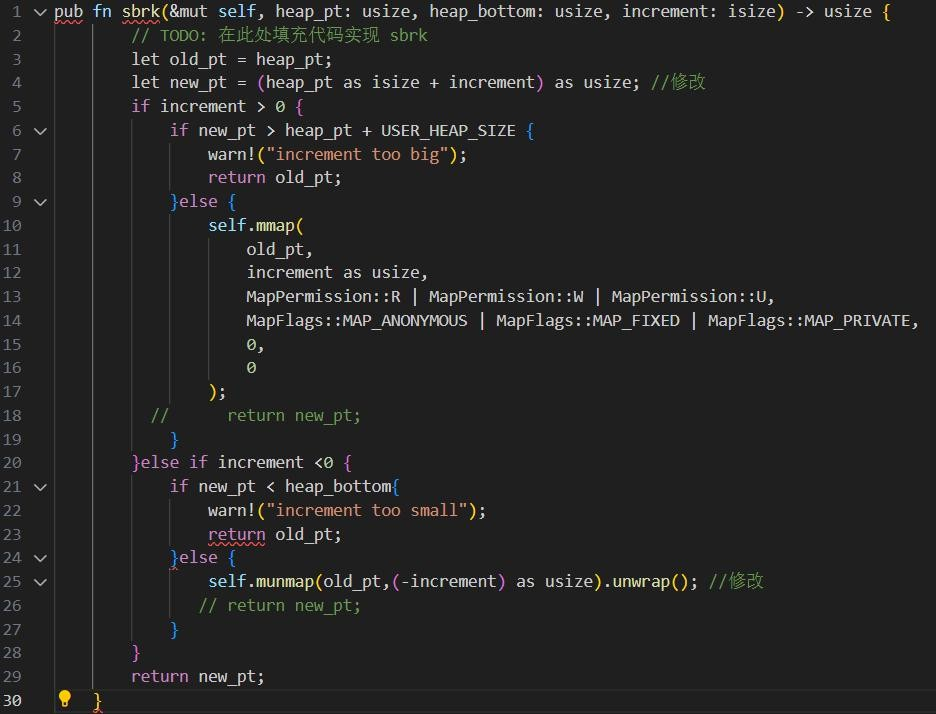 

#### **1.2.2mmap 系统调用**
  
  
首先根据提示实现缺失的两个条件，第一个条件判断区域权限与参数中指定权限相同：area是对 MapArea 结构体实例的一个引用，可以用来访问和修改 MapArea 实 例 中的 数 据 ,pub struct MapArea { inner: LinearMap,map\_type:MapType,map\_perm: MapPermission,pub map\_file: Option&lt;Arc&lt;dynFile&gt;&gt;,} 可 看 到 其 中 的 map\_prem 字 段 的 类 型 是MapPermission，和mmap中的prot字段的类型相同，所以我们可以写出第一个判断条件为：area.map\_perm== prot。

第二个判断条件是判断区域 map\_file 为空,由于map\_file是Option 类型，所以可以使用Option类型的一个方法叫做 is\_none()来判断是否为空，即：area.map\_file.is\_none()。

接下来是实现 mmap 系统调用的 MAP\_ANONYMOUS，mmap匿名映射的作⽤是在进程空间中创建⼀段指定⼤⼩的虚拟内存区域，该区域不与任何实际⽂件关联，也不会被写⼊硬盘。根据上面的提示\[mmap\]merge with previous area, callexpand\_to,可知道可以通过调用expand\_to()函数来实现mmap的匿名映射。查看expand\_to函数：

> 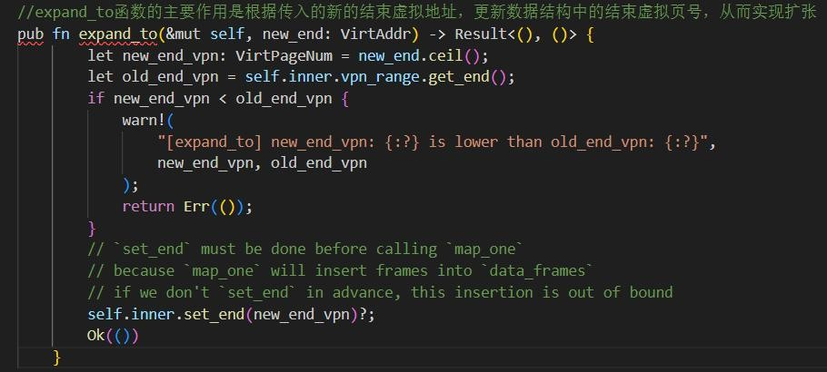 

可知道expand\_to函数函数用于将数据结构的内存范围扩展到给定的虚拟地址，确保新范围不小于旧范围。所以我们只需要将mmap中的扩展后的地址传入expand\_to函数中即可，首先需要计算出新的扩展地址，首先需要获得当前区域 的 结 束 虚 拟 地 址 ， 可 以 借 鉴 expand\_to 函 数 中self.inner.vpn\_range.get\_end（）的写法来获取当前区域的结束虚拟页号，然后在使用into()转换成虚拟地址，即 let end\_va : VirtAddr=area.inner.vpn\_range.get\_end().into(); 接 着 可 通 过VirtAddr::from(end\_va.0 + len))得到扩展后的虚拟内存地址，注意这里由于end\_va 是 VirtAddr 类型，len 是 usize 类型，这里没有实现 VirtAddr 和VirtAddr 相加的 trait，所以只能通过 usize+usize 相加然后在转换成VirtAddr 实现，这里 end\_va.0 就已经是 usize 类型的了,·pub structVirtAddr(pub usize);由于 VirtAddr 结构体定义中的唯一字段是 usize类型的公共字段 pub usize，因此在这里 .0 表示访问该结构体实例中的 usize类型 字 段 。 接 着 通 过 area 调 用 expand\_to 函 数 ， 即 ：area.expand\_to(VirtAddr::from(end\_va.0 + len)).unwrap(); 因 为expand\_to 函数返回类型是 Result&lt;(), ()&gt; 这里通过调用 unwrap来防止expand\_to函数中的新的结束地址小于旧的结束地址的错误。由于mmap的返回类型是isize，我们要在调用expand\_to函数完成扩展后，返回旧的结束地址，即returnend\_va.0 as isize。

> 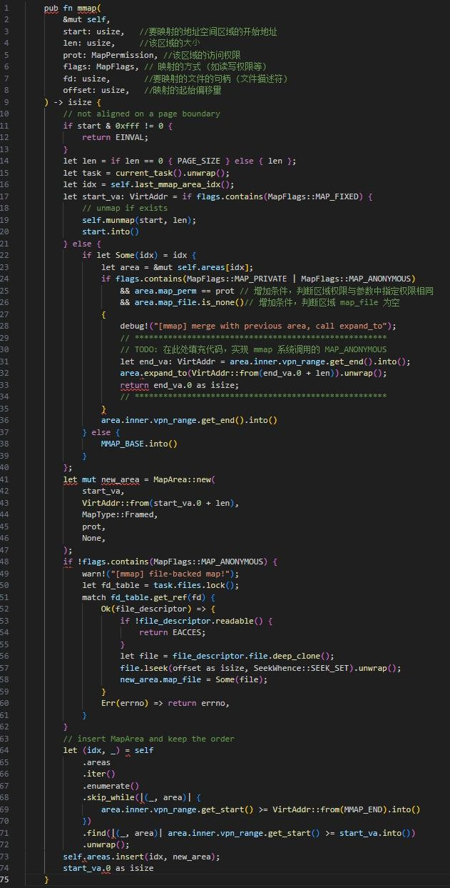 

#### 1.2.3 打印 TCB 信息

本地打印TCB信息：

首先在/oskernel2024-npucore/user/src/bin目录下创建printf\_tcb.rs

文件：

> 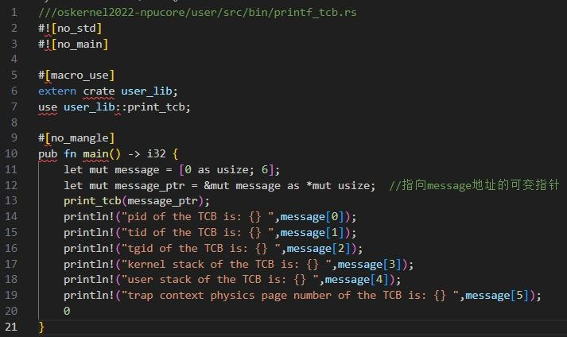 

在 /oskernel2024-npucore/user/src 目 录 下 修 改 usr\_call.rs 和syscall.rs

> 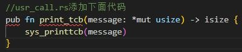 
>
> 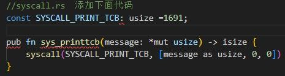 

在 /oskernel2024-npucore/os/src/syscall 目 录 下 修 改 mod.rs 和process.rs

> 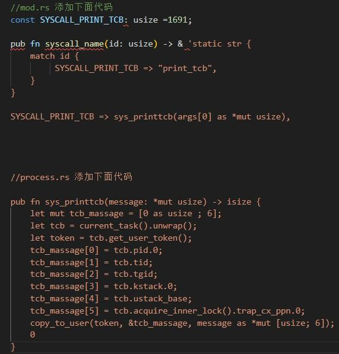 

在/oskernel2024-npucore/user目录下执行：make、make rust-user编译新编写的rust代码，生成可执行文件，接着在/oskernel2024-npucore/os目录下执行:make fat32，为NPUcore+重新加载系统镜像。 os目录下执行make run，键入print\_tcb结果如下：

>  

#### **1.2.4** 实现 **sys\_getpid** 系统调用

sys\_getpid系统调用的作用是获取自己的进程ID，所以我们只需要获取到当前的进程，然后将当前进程的id返回即可，且由上图print\_tcb实验结果可看到pid和tgid是一样的，一个进程就是线程组，这是因为NPUcore在进程管理这一章节只考虑的单线程的情况。

>  
>
> 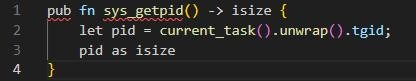 

下面编写getpid.rs来验证sys_getpid()系统调用是否正确：

> 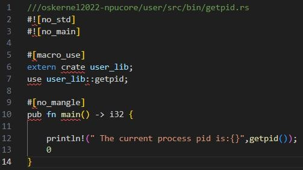 

在/oskernel2024-npucore/user目录下执行：make、make rust-user编译新编写的rust代码，生成可执行文件，接着在/oskernel2024-npucore/os目录下执行:make fat32，为NPUcore+重新加载系统镜像。

 os目录下执行make run，键入getpid后结果如下：

>  

#### **1.2.5** 实现 **getrusage** 系统调用

 
 
当用户进程发起 getrusage系统调用时，内核会收集并记录进程的资源利用情况，同时内核会将相应的资源使用信息传递给用户进程，使用户能够访问和使用这些数据。who：若为0，表示获取当前进程的信息；若为-1，表示获得子进程的信息（可不实现）。

所以实现getrusage系统调用需要先获取到当前进程的信息，然后通过copy\_to\_user()函数写入用户空间。

> 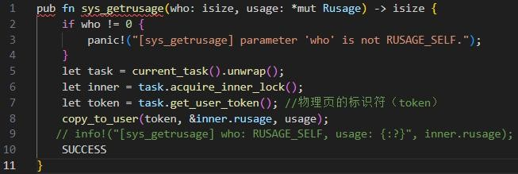 

测试sys-getrusage系统调用是否正确：

> 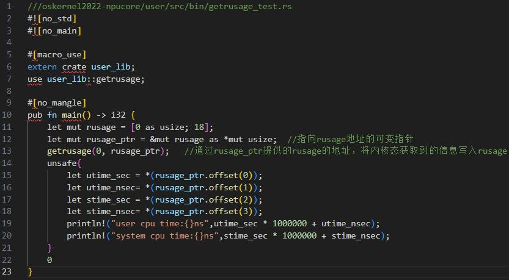 

在 /oskernel2024-npucore/user/src 目 录 下 修 改 usr\_call.rs 和syscall.rs

> 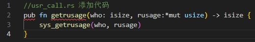 
>
> 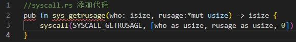 

在/oskernel2024-npucore/user目录下执行：make、make rust-user编译新编写的rust代码，生成可执行文件，接着在/oskernel2024-npucore/os目录下执行:make fat32，为NPUcore+重新加载系统镜像。 

os目录下执行make run，键入getrusage\_test结果如下：

>  

#### **1.2.6** 实现 **fork+exec** 系统调用

与清华⼤学开发的rCore教学操作系统不同，在NPUcore+中并没有特意实现 fork 系统调⽤，fork 就是特定参数下的 clone 系统调⽤。

> 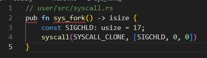 

所以我们只需要在fork中调用sys\_clone，并传入相关的参数即可。sys\_clone系统调用的传参如下：

> 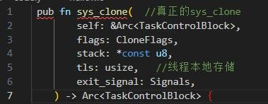 

下面开始编写sys\_fork()：

> 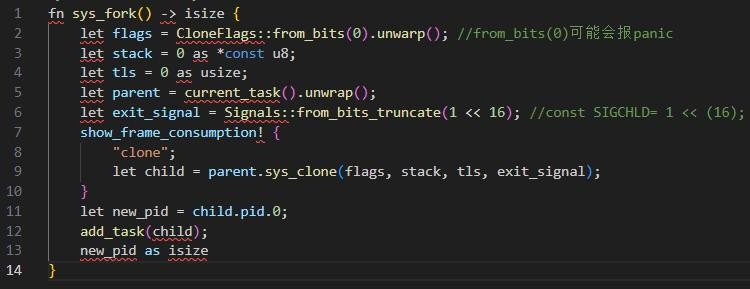 

测试fork\_test系统调用是否正确：

> 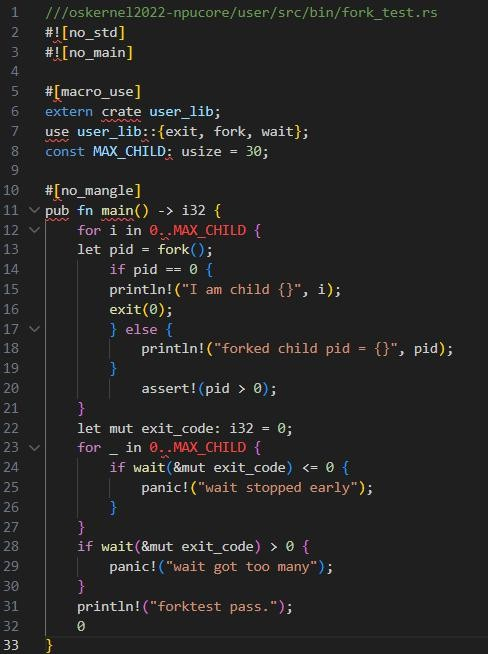 

在/oskernel2024-npucore/user目录下执行：make、make rust-user编译新编写的rust代码，生成可执行文件，接着在/oskernel2024-npucore/os目录下执行:make fat32，为NPUcore+重新加载系统镜像。 os目录下执行make run，键入fork\_test后结果如下：

>  

接下来是exec系统调用的实现：

sys\_execve系统调用是用于执行新程序的操作。它将一个新程序加载到当前进程的地址空间并执行它。

它接受三个参数：

pathname: 指向可执⾏⽂件名的⽤户空间指针 

argv:参数列表，指向⽤户空间的参数列表起始地址 

envp:环境变量表，环境变量是⼀系列键值对，字符串类型

当调用execve时，操作系统将当前进程替换为指定路径的新程序，并将其参数传递给新程序。这个调用是通过加载新的程序映像来实现的，原来的进程的代码、数据和堆栈等信息都被新的程序所取代，执行权也被移交给新程序。

> 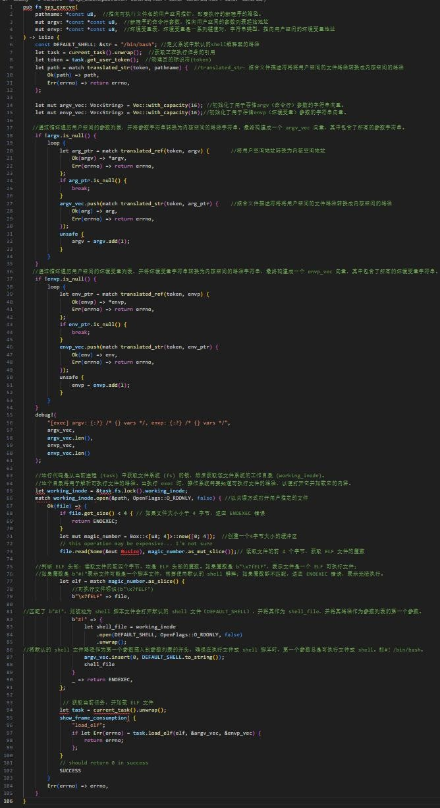 

#### **1.2.7** 实现 **sys\_clone** 系统调用

> 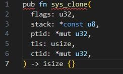 

sys\_clone系统调用一共有五个参数：

flags：用于配置新任务的不同属性。前24位记录CloneFlags信息，后8位记录Signals信息。

stack：这是一个指向用户空间中新任务堆栈的指针。如果这是NULL，则子任务将共享父任务的堆栈。

ptid 和 ctid：用于在创建子任务时存储父进程和子进程的线程 ID。

tls：无符号整数，代表新任务的线程本地存储（TLS）地址。TLS 是一种机制，用于在线程内存储线程特定的数据。它通常用于存储线程私有的数据。

clone系统调用的核心在于调用task模块中的sys\_clone方法,下面我们看下task模块中的sys\_clone的参数：

> 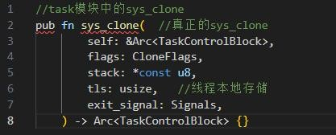 

下面我们只需要传递正确的参数，就可以通过sys\_clone实现clone系统调用：

> 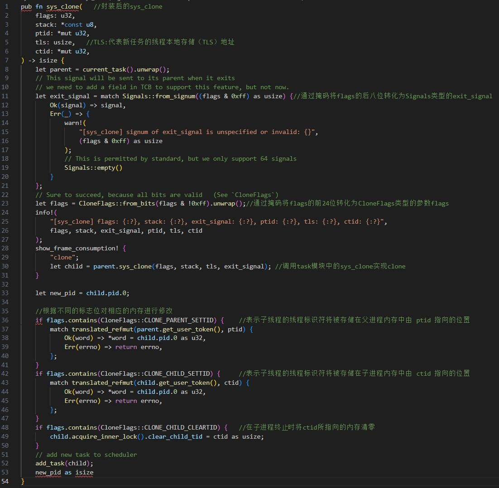 

由于我们在前面实现fork系统调用时已经验证了sys\_clone的正确性，在此不再进行验证。

####  **1.2.8** 实现 **mmap** 系统调用扩展

> 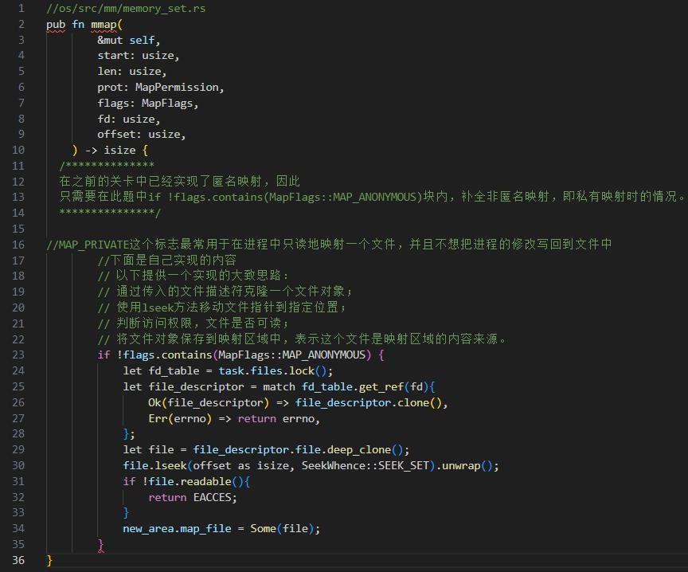 

在/oskernel2024-npucore/user目录下执行：make 编译新编写的rust代码，生成可执行文件，接着在/oskernel2024-npucore/os 目录下执行:make fat32，为NPUcore+重新加载系统镜像。os目录下执行make run。

####  **1.2.9** 实现 **open** 系统调用

> 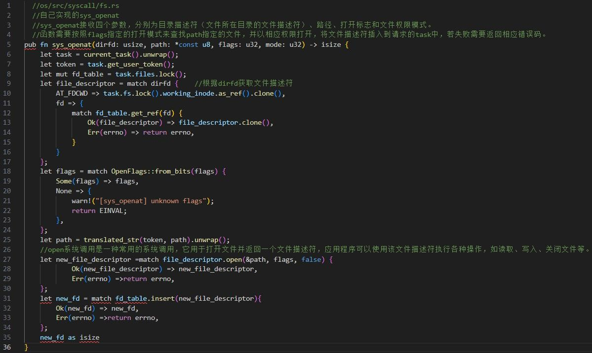 

编写用户态测试程序

> 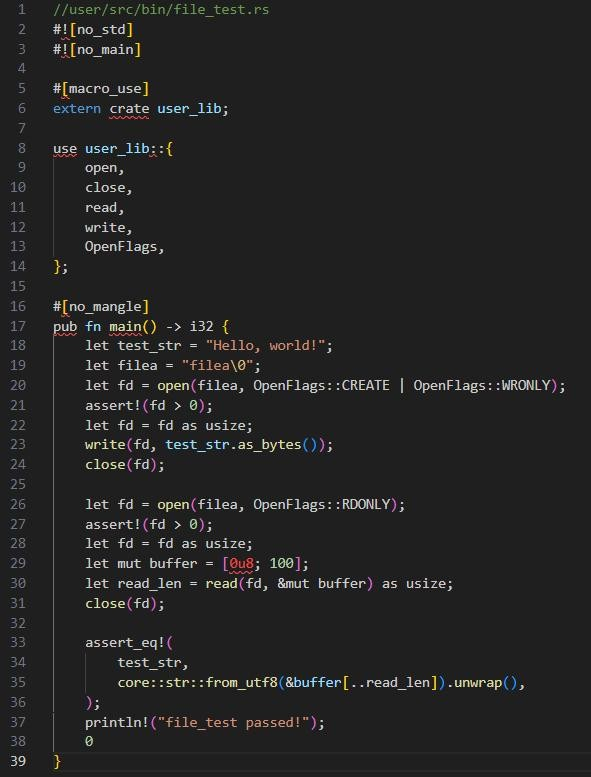 

在/oskernel2024-npucore/user目录下执行：make 编译新编写的rust代码，生成可执行文件，接着在/oskernel2024-npucore/os 目录下执行:make fat32，为 NPUcore+重新加载系统镜像。os 目录下执行 make run，进入 NPUcore+后输入：file_test，出现下面报错信息：

>  

开启LOG结合GDB进行调试os目录下执行：make run LOG=info

>  

发现和我在user目录下编写的测试程序传入的flags不一致，测试程序传入的 flags是OpenFlags::CREATE | OpenFlags::WRONLY，在打开文件时 CREATE 标志使得如果 filea原本不存在，文件系统会自动创建一个同名文件，如果已经存在的话则会清空它的内容。而
WRONLY 使得此次只能写入该文件而不能读取。但是而内核这里接收到的却是O\_WRONLY | O\_TRUNC，查看内核 OpenFlags
（os/src/layout.rs）的定义发现：\*const\* O\_CREAT =0o100;而在user目录下(/user/src/lib.rs)发现:\*const\* CREATE = 1 &lt;&lt;
9;在这里发现两者定义不匹配，0o100（八进制）为0b1000000（二进制） 为1&lt;&lt;7，而不是1&lt;&lt;9。

> 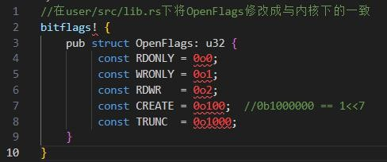 
