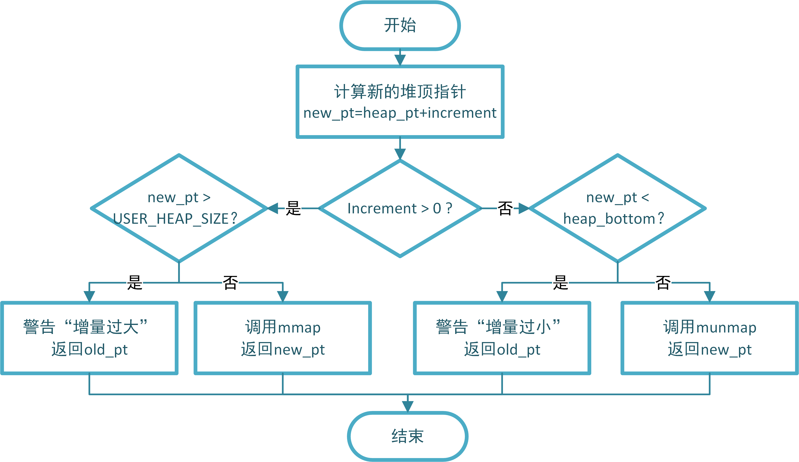
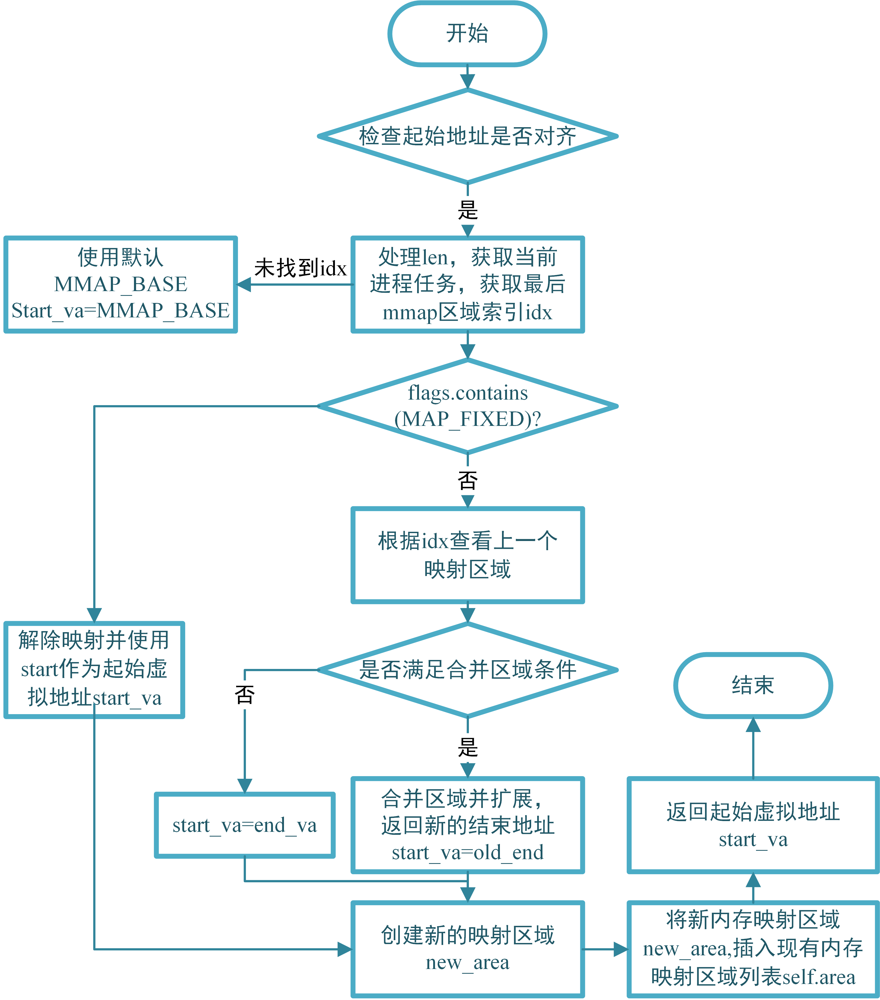
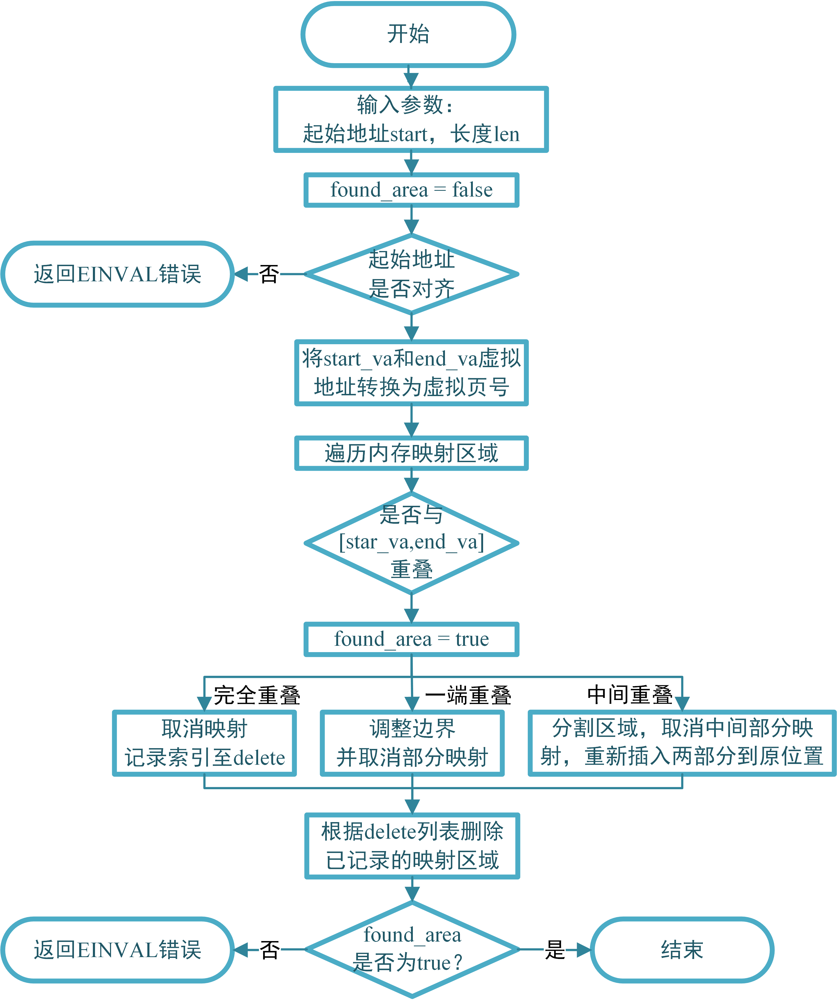
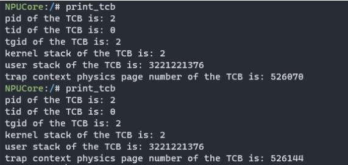
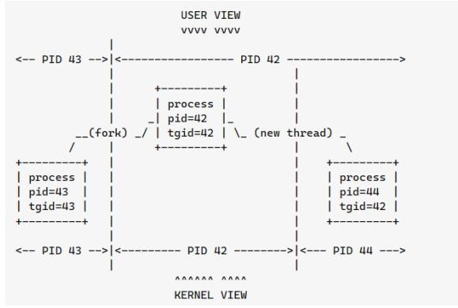
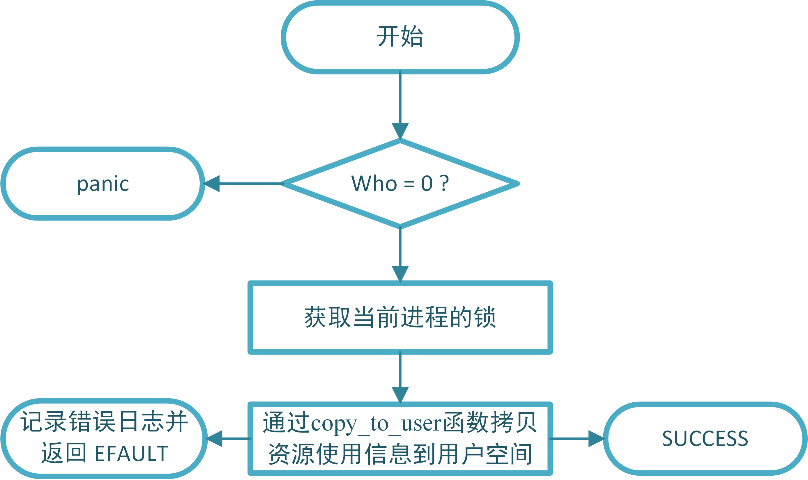
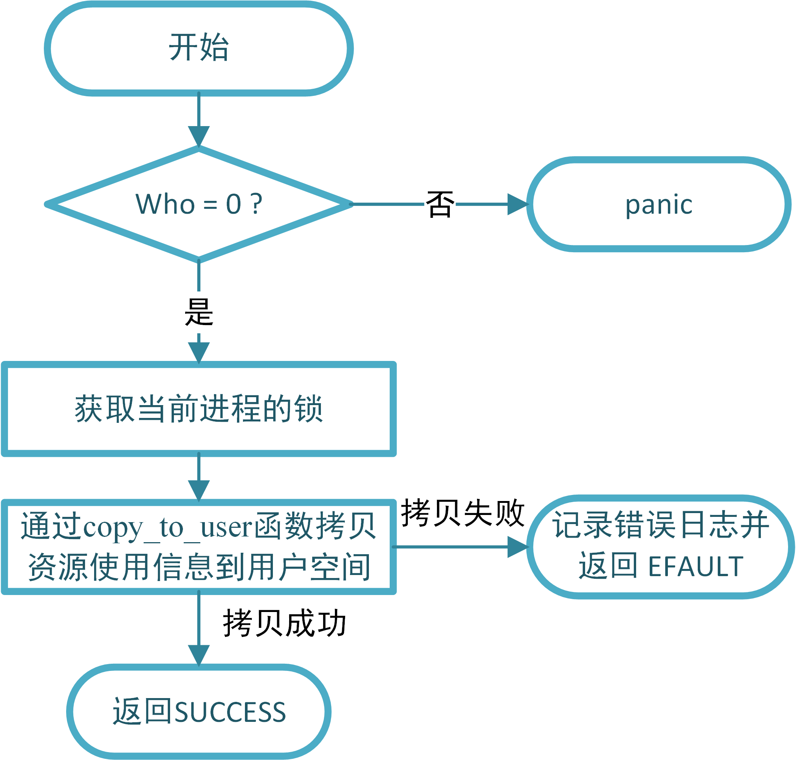
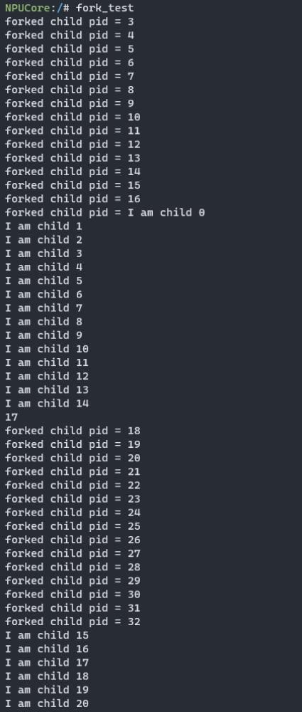

系统调用
====================

### 1.1 系统调用的流程

系统调用就是对操作系统内核中的一组用于实现系统功能的过程的调用。用户程序可以利用系统调用，向操作系统发出服务请求；操作系统通过系统调用为运行于其上的应用程序提供服务。操作系统与运行在用户态软件之间的接口形式就是应用程序二进制接口(ABI, Application BinaryInterface)。操作系统设计了一套安全可靠的二进制接口，我们称为系统调用接口(System Call Interface)。系统调用接口通常面向应用程序提供了 API的描述，但在具体实现上，还需要提供 ABI 的接口描述规范。

凡是与资源有关的操作、会影响到其它进程的操作，为了方便管理资源（防止恶意操作）、使进程间隔离，操作系统必须介入，实现统一管理调度。操作系统为上层编程语言提供了一套接口，这套接口就是系统调用。

### **1.2** 一些系统调用的实现

#### **1.2.1sbrk 系统调用**
 
sbrk系统调用用于改变进程的堆的大小。堆是一段长度可变的连续虚拟内存，始于进程的未初始化数据段末尾，随着内存的分配和释放而增减。通常将堆的当前内存边界称为“program*\*br\*\*ea\*\*k\*\*”。

sbrk系统调用的作用是将进程的堆空间扩大或缩小一定的尺寸。要注意不能超过用户空间大小限制，也不能使堆顶指针小于堆底指针。

sbrk 系统调用核心功能的实现由 MemorySet 接口下的 sbrk 函数完成，

>  

sbrk 系统调用将堆的大小增加 increment 字节，并返回堆的起始地址。如果increment 为负数，则堆的大小减少 increment字节。如果堆的大小超过了进程的地址空间，则 sbrk系统调用返回-1，并设置errno 为 ENOMEM。 sbrk系统调用可以为一个进程扩大或者缩小堆的大小，主要的实现是由os/src/memory\_set.rs 中 的 sbrk 函 数 完 成 。 sbrk 函 数 调 用Memoryset::mmap 或者 Memoryset::munmap 来实现堆的扩大或者缩小。mmap函数不仅用于 sbrk 系统调用，还用于 mmap系统调用，用于将文件映射到用户空间和开辟匿名内存映射。

```rust
pub fn sbrk(&mut self, heap_pt: usize, heap_bottom: usize, increment: isize) -> usize {
        // TODO: 在此处填充代码实现 sbrk
        let old_pt = heap_pt;
        let new_pt = (heap_pt as isize + increment) as usize; //修改
        if increment > 0 {
            if new_pt > heap_pt + USER_HEAP_SIZE {
                warn!("increment too big");
                return old_pt;
            }else {
                self.mmap(
                    old_pt,
                    increment as usize,
                    MapPermission::R | MapPermission::W | MapPermission::U,
                    MapFlags::MAP_ANONYMOUS | MapFlags::MAP_FIXED | MapFlags::MAP_PRIVATE,
                    0,
                    0
                );
          //      return new_pt;
            }
        }else if increment <0 {
            if new_pt < heap_bottom{
                warn!("increment too small");
                return old_pt;
            }else {
                self.munmap(old_pt,(-increment) as usize).unwrap(); //修改
               // return new_pt;
            }
        }
        return new_pt;
    }
  
```


#### **1.2.2mmap 系统调用**
  
  
首先根据提示实现缺失的两个条件，第一个条件判断区域权限与参数中指定权限相同：area是对 MapArea 结构体实例的一个引用，可以用来访问和修改 MapArea 实 例 中的 数 据 ,pub struct MapArea { inner: LinearMap,map\_type:MapType,map\_perm: MapPermission,pub map\_file: Option&lt;Arc&lt;dynFile&gt;&gt;,} 可 看 到 其 中 的 map\_prem 字 段 的 类 型 是MapPermission，和mmap中的prot字段的类型相同，所以我们可以写出第一个判断条件为：area.map\_perm== prot。

第二个判断条件是判断区域 map\_file 为空,由于map\_file是Option 类型，所以可以使用Option类型的一个方法叫做 is\_none()来判断是否为空，即：area.map\_file.is\_none()。

接下来是实现 mmap 系统调用的 MAP\_ANONYMOUS，mmap匿名映射的作⽤是在进程空间中创建⼀段指定⼤⼩的虚拟内存区域，该区域不与任何实际⽂件关联，也不会被写⼊硬盘。根据上面的提示\[mmap\]merge with previous area, callexpand\_to,可知道可以通过调用expand\_to()函数来实现mmap的匿名映射。查看expand\_to函数：

```rust
pub fn expand_to(&mut self, new_end: VirtAddr) -> Result<(), ()> {
        let new_end_vpn: VirtPageNum = new_end.ceil();
        let old_end_vpn = self.inner.vpn_range.get_end();
        if new_end_vpn < old_end_vpn {
            warn!(
                "[expand_to] new_end_vpn: {:?} is lower than old_end_vpn: {:?}",
                new_end_vpn, old_end_vpn
            );
            return Err(());
        }
        // `set_end` must be done before calling `map_one`
        // because `map_one` will insert frames into `data_frames`
        // if we don't `set_end` in advance, this insertion is out of bound
        self.inner.set_end(new_end_vpn)?;
        Ok(())
    }
```

可知道expand\_to函数函数用于将数据结构的内存范围扩展到给定的虚拟地址，确保新范围不小于旧范围。所以我们只需要将mmap中的扩展后的地址传入expand\_to函数中即可，首先需要计算出新的扩展地址，首先需要获得当前区域 的 结 束 虚 拟 地 址 ， 可 以 借 鉴 expand\_to 函 数 中self.inner.vpn\_range.get\_end（）的写法来获取当前区域的结束虚拟页号，然后在使用into()转换成虚拟地址，即 let end\_va : VirtAddr=area.inner.vpn\_range.get\_end().into(); 接 着 可 通 过VirtAddr::from(end\_va.0 + len))得到扩展后的虚拟内存地址，注意这里由于end\_va 是 VirtAddr 类型，len 是 usize 类型，这里没有实现 VirtAddr 和VirtAddr 相加的 trait，所以只能通过 usize+usize 相加然后在转换成VirtAddr 实现，这里 end\_va.0 就已经是 usize 类型的了,·pub structVirtAddr(pub usize);由于 VirtAddr 结构体定义中的唯一字段是 usize类型的公共字段 pub usize，因此在这里 .0 表示访问该结构体实例中的 usize类型 字 段 。 接 着 通 过 area 调 用 expand\_to 函 数 ， 即 ：area.expand\_to(VirtAddr::from(end\_va.0 + len)).unwrap(); 因 为expand\_to 函数返回类型是 Result&lt;(), ()&gt; 这里通过调用 unwrap来防止expand\_to函数中的新的结束地址小于旧的结束地址的错误。由于mmap的返回类型是isize，我们要在调用expand\_to函数完成扩展后，返回旧的结束地址，即returnend\_va.0 as isize。

```rust
    pub fn mmap(
        &mut self,
        start: usize, 	//要映射的地址空间区域的开始地址
        len: usize,		//该区域的⼤⼩
        prot: MapPermission, //该区域的访问权限
        flags: MapFlags, // 映射的⽅式 (如读写权限等)
        fd: usize,       //要映射的⽂件的句柄 (⽂件描述符)
        offset: usize,   //映射的起始偏移量
    ) -> isize {
        // not aligned on a page boundary
        if start & 0xfff != 0 {
            return EINVAL;
        }
        let len = if len == 0 { PAGE_SIZE } else { len };
        let task = current_task().unwrap();
        let idx = self.last_mmap_area_idx();
        let start_va: VirtAddr = if flags.contains(MapFlags::MAP_FIXED) {
            // unmap if exists
            self.munmap(start, len);
            start.into()
        } else {
            if let Some(idx) = idx {
                let area = &mut self.areas[idx];
                if flags.contains(MapFlags::MAP_PRIVATE | MapFlags::MAP_ANONYMOUS)
                    && area.map_perm == prot // 增加条件，判断区域权限与参数中指定权限相同
                    && area.map_file.is_none()// 增加条件，判断区域 map_file 为空
                {
                    debug!("[mmap] merge with previous area, call expand_to");
                    // *****************************************************
                    // TODO: 在此处填充代码，实现 mmap 系统调用的 MAP_ANONYMOUS
                    let end_va: VirtAddr = area.inner.vpn_range.get_end().into();
                    area.expand_to(VirtAddr::from(end_va.0 + len)).unwrap();
                    return end_va.0 as isize;
                    // *****************************************************
                }
                area.inner.vpn_range.get_end().into()
            } else {
                MMAP_BASE.into()
            }
        };
        let mut new_area = MapArea::new(
            start_va,
            VirtAddr::from(start_va.0 + len),
            MapType::Framed,
            prot,
            None,
        );
        if !flags.contains(MapFlags::MAP_ANONYMOUS) {
            warn!("[mmap] file-backed map!");
            let fd_table = task.files.lock();
            match fd_table.get_ref(fd) {
                Ok(file_descriptor) => {
                    if !file_descriptor.readable() {
                        return EACCES;
                    }
                    let file = file_descriptor.file.deep_clone();
                    file.lseek(offset as isize, SeekWhence::SEEK_SET).unwrap();
                    new_area.map_file = Some(file);
                }
                Err(errno) => return errno,
            }
        }
        // insert MapArea and keep the order
        let (idx, _) = self
            .areas
            .iter()
            .enumerate()
            .skip_while(|(_, area)| {
                area.inner.vpn_range.get_start() >= VirtAddr::from(MMAP_END).into()
            })
            .find(|(_, area)| area.inner.vpn_range.get_start() >= start_va.into())
            .unwrap();
        self.areas.insert(idx, new_area);
        start_va.0 as isize
    }
```

#### 1.2.3 打印 TCB 信息

本地打印TCB信息：

首先在/oskernel2024-npucore/user/src/bin目录下创建printf\_tcb.rs

文件：

```rust
#![no_std]
#![no_main]

#[macro_use]
extern crate user_lib;
use user_lib::print_tcb;

#[no_mangle]
pub fn main() -> i32 {
    let mut message = [0 as usize; 6];
    let mut message_ptr = &mut message as *mut usize;  //指向message地址的可变指针
    print_tcb(message_ptr);
    println!("pid of the TCB is: {} ",message[0]);
    println!("tid of the TCB is: {} ",message[1]);
    println!("tgid of the TCB is: {} ",message[2]);
    println!("kernel stack of the TCB is: {} ",message[3]);
    println!("user stack of the TCB is: {} ",message[4]);
    println!("trap context physics page number of the TCB is: {} ",message[5]);
    0
}
```

在 /oskernel2024-npucore/user/src 目 录 下 修 改 usr\_call.rs 和syscall.rs

```rust
//usr_call.rs添加下面代码
pub fn print_tcb(message: *mut usize) -> isize {
    sys_printtcb(message)
}
```

```rust
//syscall.rs  添加下面代码
const SYSCALL_PRINT_TCB: usize =1691;

pub fn sys_printtcb(message: *mut usize) -> isize {
    syscall(SYSCALL_PRINT_TCB, [message as usize, 0, 0])
}
```

在 /oskernel2024-npucore/os/src/syscall 目 录 下 修 改 mod.rs 和process.rs

~~~rust
//mod.rs 添加下面代码
const SYSCALL_PRINT_TCB: usize =1691;

pub fn syscall_name(id: usize) -> &'static str {
    match id {
         SYSCALL_PRINT_TCB => "print_tcb",
    }
}

SYSCALL_PRINT_TCB => sys_printtcb(args[0] as *mut usize),
```

``` rust
//process.rs 添加下面代码

pub fn sys_printtcb(message: *mut usize) -> isize {
    let mut tcb_massage = [0 as usize ; 6];
    let tcb = current_task().unwrap();
    let token = tcb.get_user_token();
    tcb_massage[0] = tcb.pid.0;
    tcb_massage[1] = tcb.tid;
    tcb_massage[2] = tcb.tgid;
    tcb_massage[3] = tcb.kstack.0;
    tcb_massage[4] = tcb.ustack_base;
    tcb_massage[5] = tcb.acquire_inner_lock().trap_cx_ppn.0;
    copy_to_user(token, &tcb_massage, message as *mut [usize; 6]);
    0

}
~~~

在/oskernel2024-npucore/user目录下执行：make、make rust-user编译新编写的rust代码，生成可执行文件，接着在/oskernel2024-npucore/os目录下执行:make fat32，为NPUcoreLA重新加载系统镜像。 os目录下执行make run，键入print\_tcb结果如下：

>  

#### **1.2.4** 实现 **sys\_getpid** 系统调用

sys\_getpid系统调用的作用是获取自己的进程ID，所以我们只需要获取到当前的进程，然后将当前进程的id返回即可，且由上图print\_tcb实验结果可看到pid和tgid是一样的，一个进程就是线程组，这是因为NPUcoreLA在进程管理这一章节只考虑的单线程的情况。

>  
>
> ```rust
> pub fn sys_getpid() -> isize {
>     let pid = current_task().unwrap().tgid;
>     pid as isize
> }
> ```

下面编写getpid.rs来验证sys_getpid()系统调用是否正确：

```rust
///oskernel2022-npucore/user/src/bin/getpid.rs
#![no_std]
#![no_main]

#[macro_use]
extern crate user_lib;
use user_lib::getpid;

#[no_mangle]
pub fn main() -> i32 {

    println!(" The current process pid is:{}",getpid());
    0
}
```

在/oskernel2024-npucore/user目录下执行：make、make rust-user编译新编写的rust代码，生成可执行文件，接着在/oskernel2024-npucore/os目录下执行:make fat32，为NPUcoreLA重新加载系统镜像。

 os目录下执行make run，键入getpid后结果如下：

>  

#### **1.2.5** 实现 **getrusage** 系统调用

 
 
当用户进程发起 getrusage系统调用时，内核会收集并记录进程的资源利用情况，同时内核会将相应的资源使用信息传递给用户进程，使用户能够访问和使用这些数据。who：若为0，表示获取当前进程的信息；若为-1，表示获得子进程的信息（可不实现）。

所以实现getrusage系统调用需要先获取到当前进程的信息，然后通过copy\_to\_user()函数写入用户空间。

```rust
pub fn sys_getrusage(who: isize, usage: *mut Rusage) -> isize {
    if who != 0 {
        panic!("[sys_getrusage] parameter 'who' is not RUSAGE_SELF.");
    }
    let task = current_task().unwrap();
    let inner = task.acquire_inner_lock();
    let token = task.get_user_token();       //物理页的标识符（token）
    if copy_to_user(token, &inner.rusage, usage).is_err() {
        log::error!("[sys_getrusage] Failed to copy to {:?}", usage);
        return EFAULT;
    };
    //info!("[sys_getrusage] who: RUSAGE_SELF, usage: {:?}", inner.rusage);
    SUCCESS
}
```

测试sys-getrusage系统调用是否正确：

```rust
#![no_std]
#![no_main]

#[macro_use]
extern crate user_lib;
use user_lib::getrusage;

#[no_mangle]
pub fn main() -> i32 {
    let mut rusage = [0 as usize; 18];
    let mut rusage_ptr = &mut rusage as *mut usize;  //指向rusage地址的可变指针
    getrusage(0, rusage_ptr);	//通过rusage_ptr提供的rusage的地址，将内核态获取到的信息写入rusage
    unsafe{
        let utime_sec = *(rusage_ptr.offset(0));
        let utime_nsec= *(rusage_ptr.offset(1));
        let stime_sec = *(rusage_ptr.offset(2));
        let stime_nsec= *(rusage_ptr.offset(3));
        println!("user cpu time:{}ns",utime_sec * 1000000 + utime_nsec);
        println!("system cpu time:{}ns",stime_sec * 1000000 + stime_nsec);
    }
    0
}
```

在 /oskernel2024-npucore/user/src 目 录 下 修 改 usr\_call.rs 和syscall.rs

> ```rust
> //usr_call.rs 添加代码
> pub fn getrusage(who: isize, rusage:*mut usize) -> isize {
>     sys_getrusage(who, rusage)
> }
> ```
>
> ```rust
> pub fn sys_getrusage(who: isize, rusage:*mut usize) -> isize {
>     syscall(SYSCALL_GETRUSAGE, [who as usize, rusage as usize, 0])
> }
> ```

在/oskernel2024-npucore/user目录下执行：make、make rust-user编译新编写的rust代码，生成可执行文件，接着在/oskernel2024-npucore/os目录下执行:make fat32，为NPUcoreLA重新加载系统镜像。 

os目录下执行make run，键入getrusage\_test结果如下：

>  

#### **1.2.6** 实现 **fork+exec** 系统调用

与清华⼤学开发的rCore教学操作系统不同，在NPUcoreLA中并没有特意实现 fork 系统调⽤，fork 就是特定参数下的 clone 系统调⽤。

```rust
pub fn sys_fork() -> isize {
    const SIGCHLD: usize = 17;
    syscall(SYSCALL_CLONE, [SIGCHLD, 0, 0])
}
```

所以我们只需要在fork中调用sys\_clone，并传入相关的参数即可。sys\_clone系统调用的传参如下：

```rust
 pub fn sys_clone(  //真正的sys_clone
        self: &Arc<TaskControlBlock>,
        flags: CloneFlags,
        stack: *const u8,
        tls: usize,   //线程本地存储
        exit_signal: Signals,
    ) -> Arc<TaskControlBlock> {
```

下面开始编写sys\_fork()：

```rust
pub fn sys_fork() -> isize {
    let flags = CloneFlags::from_bits(0x00000100).unwrap();  //CLONE_VM⽗⼦进程会共享同⼀个虚拟内存⻚
    let stack = 0 as *const u8;
    let tls = 0 as usize;  //线程本地存储
    let exit_signal = Signals::from_bits_truncate(1 << 16);//const SIGCHLD= 1 << (16);
    let parent = current_task().unwrap();
    show_frame_consumption! {
        "clone";
        let child = parent.sys_clone(flags, stack, tls, exit_signal); 
    }
    let new_pid = child.pid.0;
    add_task(child);
    new_pid as isize
}
```

测试fork\_test系统调用是否正确：

```rust
#![no_std]
#![no_main]

#[macro_use]
extern crate user_lib;

use user_lib::{fork, wait, exit};

const MAX_CHILD: usize = 40;

#[no_mangle]
pub fn main() -> i32 {
    for i in 0..MAX_CHILD {
        let pid = fork();
        if pid == 0 {
            println!("I am child {}", i);
            exit(0);
        } else {
            println!("forked child pid = {}", pid);
        }
        assert!(pid > 0);
    }
    let mut exit_code: i32 = 0;
    for _ in 0..MAX_CHILD {
        if wait(&mut exit_code) <= 0 {
            panic!("wait stopped early");
        }
    }
    if wait(&mut exit_code) > 0 {
        panic!("wait got too many");
    }
    println!("forktest pass.");
    0
}
```

在/oskernel2024-npucore/user目录下执行：make、make rust-user编译新编写的rust代码，生成可执行文件，接着在/oskernel2024-npucore/os目录下执行:make fat32，为NPUcoreLA重新加载系统镜像。 os目录下执行make run，键入fork\_test后结果如下：

>  

接下来是exec系统调用的实现：

sys\_execve系统调用是用于执行新程序的操作。它将一个新程序加载到当前进程的地址空间并执行它。

它接受三个参数：

pathname: 指向可执⾏⽂件名的⽤户空间指针 

argv:参数列表，指向⽤户空间的参数列表起始地址 

envp:环境变量表，环境变量是⼀系列键值对，字符串类型

当调用execve时，操作系统将当前进程替换为指定路径的新程序，并将其参数传递给新程序。这个调用是通过加载新的程序映像来实现的，原来的进程的代码、数据和堆栈等信息都被新的程序所取代，执行权也被移交给新程序。

```rust
pub fn sys_execve(
    pathname: *const u8,  //指向可执⾏⽂件名的⽤户空间指针，即要执行的新程序的路径。
    mut argv: *const *const u8,  //新程序的命令行参数，指向⽤户空间的参数列表起始地址
    mut envp: *const *const u8,  //环境变量表，环境变量是⼀系列键值对，字符串类型，指向用户空间的环境变量地址
) -> isize {
    const DEFAULT_SHELL: &str = "/bin/bash"; //定义系统中默认的shell解释器的路径
    let task = current_task().unwrap();  //获取正在执行任务的引用
    let token = task.get_user_token();  //物理页的标识符(token)
    let path = match translated_str(token, pathname) {  //translated_str：结合⽂件描述符将将用户空间的文件路径转换成内核空间的路径
        Ok(path) => path,
        Err(errno) => return errno,
    };
    
    let mut argv_vec: Vec<String> = Vec::with_capacity(16); //初始化了用于存储argv（命令行）参数的字符串向量。
    let mut envp_vec: Vec<String> = Vec::with_capacity(16);//初始化了用于存储envp（环境变量）参数的字符串向量。
    
   //通过循环遍历用户空间的参数列表，并将参数字符串转换为内核空间的路径字符串，最终构建成一个 argv_vec 向量，其中包含了所有的参数字符串。
    if !argv.is_null() {
        loop {
            let arg_ptr = match translated_ref(token, argv) {		//将用户空间地址转换为内核空间地址
                Ok(argv) => *argv,
                Err(errno) => return errno,
            };
            if arg_ptr.is_null() {
                break;
            }
            argv_vec.push(match translated_str(token, arg_ptr) {	//结合⽂件描述符将将用户空间的文件路径转换成内核空间的路径
                Ok(arg) => arg,
                Err(errno) => return errno,
            });
            unsafe {
                argv = argv.add(1);
            }
        }
    }
   //通过循环遍历用户空间的环境变量列表，并将环境变量字符串转换为内核空间的路径字符串，最终构建成一个 envp_vec 向量，其中包含了所有的环境变量字符串。
    if !envp.is_null() {
        loop {
            let env_ptr = match translated_ref(token, envp) {
                Ok(envp) => *envp,
                Err(errno) => return errno,
            };
            if env_ptr.is_null() {
                break;
            }
            envp_vec.push(match translated_str(token, env_ptr) {
                Ok(env) => env,
                Err(errno) => return errno,
            });
            unsafe {
                envp = envp.add(1);
            }
        }
    }
    debug!(
        "[exec] argv: {:?} /* {} vars */, envp: {:?} /* {} vars */",
        argv_vec,
        argv_vec.len(),
        envp_vec,
        envp_vec.len()
    );
    
    //这行代码是从当前进程 (task) 中获取文件系统 (fs) 的锁，然后获取该文件系统的工作目录 (working_inode)。
    //这个目录将用于解析可执行文件的路径。当执行 exec 时，操作系统需要知道可执行文件的路径，以便打开它并加载它的内容。
    let working_inode = &task.fs.lock().working_inode;
    match working_inode.open(&path, OpenFlags::O_RDONLY, false) { //以只读方式打开用户指定的文件
        Ok(file) => {
            if file.get_size() < 4 { // 如果文件大小小于 4 字节，返回 ENOEXEC 错误
                return ENOEXEC;
            }
            let mut magic_number = Box::<[u8; 4]>::new([0; 4]);  //创建一个4字节大小的缓冲区
            // this operation may be expensive... I'm not sure
            file.read(Some(&mut 0usize), magic_number.as_mut_slice());// 读取文件的前 4 个字节，获取 ELF 文件的魔数
            
 	//判断 ELF 头部：读取文件的前四个字节，这是 ELF 头部的魔数。如果魔数是 b"\x7fELF"，表示文件是一个 ELF 可执行文件；
    //如果魔数是 b"#!"表示文件可能是一个脚本文件，需要使用默认的 shell 解释；如果魔数都不匹配，返回 ENOEXEC 错误，表示无法执行。
            let elf = match magic_number.as_slice() {
      			//可执行文件标识(b"\x7fELF")
                b"\x7fELF" => file,  
                
//匹配了 b"#!"，则被视为 shell 脚本文件会打开默认的 shell 文件（DEFAULT_SHELL），并将其作为 shell_file，并将其路径作为参数列表的第一个参数。
                b"#!" => {  
                    let shell_file = working_inode
                        .open(DEFAULT_SHELL, OpenFlags::O_RDONLY, false)
                        .unwrap();
//将默认的 shell 文件路径作为第一个参数插入到参数列表的开头，确保在执行文件或 shell 脚本时，第一个参数总是可执行文件或 shell。即#！/bin/bash。
                    argv_vec.insert(0, DEFAULT_SHELL.to_string()); 
                    shell_file
                }
                _ => return ENOEXEC,
            };
            
             // 获取当前任务，并加载 ELF 文件
            let task = current_task().unwrap();
            show_frame_consumption! {
                "load_elf";
                if let Err(errno) = task.load_elf(elf, &argv_vec, &envp_vec) {
                    return errno;
                };
            }
            // should return 0 in success
            SUCCESS
        }
        Err(errno) => errno,
    }
}
```

#### **1.2.7** 实现 **sys\_clone** 系统调用

```rust
pub fn sys_clone( 
  flags: u32,
  stack: *const u8,
  ptid: *mut u32,
  tls: usize,
  ctid: *mut u32,
) -> isize {}
```

sys\_clone系统调用一共有五个参数：

flags：用于配置新任务的不同属性。前24位记录CloneFlags信息，后8位记录Signals信息。

stack：这是一个指向用户空间中新任务堆栈的指针。如果这是NULL，则子任务将共享父任务的堆栈。

ptid 和 ctid：用于在创建子任务时存储父进程和子进程的线程 ID。

tls：无符号整数，代表新任务的线程本地存储（TLS）地址。TLS 是一种机制，用于在线程内存储线程特定的数据。它通常用于存储线程私有的数据。

clone系统调用的核心在于调用task模块中的sys\_clone方法,下面我们看下task模块中的sys\_clone的参数：

```rust
 pub fn sys_clone(  //真正的sys_clone
        self: &Arc<TaskControlBlock>,
        flags: CloneFlags,
        stack: *const u8,
        tls: usize,   //线程本地存储
        exit_signal: Signals,
    ) -> Arc<TaskControlBlock> {
```

下面我们只需要传递正确的参数，就可以通过sys\_clone实现clone系统调用：

```rust
pub fn sys_clone(   //封装后的sys_clone
    flags: u32,
    stack: *const u8,
    ptid: *mut u32,
    tls: usize,   //TLS:代表新任务的线程本地存储（TLS）地址
    ctid: *mut u32,
) -> isize {
    let parent = current_task().unwrap();
    // This signal will be sent to its parent when it exits
    // we need to add a field in TCB to support this feature, but not now.
    let exit_signal = match Signals::from_signum((flags & 0xff) as usize) {//通过掩码将flags的后八位转化为Signals类型的exit_signal
        Ok(signal) => signal,
        Err(_) => {
            warn!(
                "[sys_clone] signum of exit_signal is unspecified or invalid: {}",
                (flags & 0xff) as usize
            );
            // This is permitted by standard, but we only support 64 signals
            Signals::empty()
        }
    };
    // Sure to succeed, because all bits are valid   (See `CloneFlags`)
    let flags = CloneFlags::from_bits(flags & !0xff).unwrap();//通过掩码将flags的前24位转化为CloneFlags类型的参数flags
    info!(
        "[sys_clone] flags: {:?}, stack: {:?}, exit_signal: {:?}, ptid: {:?}, tls: {:?}, ctid: {:?}",
        flags, stack, exit_signal, ptid, tls, ctid
    );
    show_frame_consumption! {
        "clone";
        let child = parent.sys_clone(flags, stack, tls, exit_signal); //调用task模块中的sys_clone实现clone
    }

    let new_pid = child.pid.0;
    
    //根据不同的标志位对相应的内存进行修改
    if flags.contains(CloneFlags::CLONE_PARENT_SETTID) {    //表示子线程的线程标识符将被存储在父进程内存中由 ptid 指向的位置
        match translated_refmut(parent.get_user_token(), ptid) { 
            Ok(word) => *word = child.pid.0 as u32,
            Err(errno) => return errno,
        };
    }
    if flags.contains(CloneFlags::CLONE_CHILD_SETTID) {     //表示子线程的线程标识符将被存储在子进程内存中由 ctid 指向的位置
        match translated_refmut(child.get_user_token(), ctid) {
            Ok(word) => *word = child.pid.0 as u32,
            Err(errno) => return errno,
        };
    }
    if flags.contains(CloneFlags::CLONE_CHILD_CLEARTID) {   //在⼦进程终⽌时将ctid所指向的内存清零
        child.acquire_inner_lock().clear_child_tid = ctid as usize;
    }
    // add new task to scheduler
    add_task(child);
    new_pid as isize
}
```

由于我们在前面实现fork系统调用时已经验证了sys\_clone的正确性，在此不再进行验证。

####  **1.2.8** 实现 **mmap** 系统调用扩展

```rust
//os/src/mm/memory_set.rs
pub fn mmap(
        &mut self,
        start: usize,
        len: usize,
        prot: MapPermission,
        flags: MapFlags,
        fd: usize,
        offset: usize,
    ) -> isize {
  /**************
  在之前的关卡中已经实现了匿名映射，因此
  只需要在此题中if !flags.contains(MapFlags::MAP_ANONYMOUS)块内，补全非匿名映射，即私有映射时的情况。
  ***************/ 
        
//MAP_PRIVATE这个标志最常用于在进程中只读地映射一个文件，并且不想把进程的修改写回到文件中
        //下面是自己实现的内容
        // 以下提供一个实现的大致思路：
        // 通过传入的文件描述符克隆一个文件对象；
        // 使用lseek方法移动文件指针到指定位置；
        // 判断访问权限，文件是否可读；
        // 将文件对象保存到映射区域中，表示这个文件是映射区域的内容来源。
        if !flags.contains(MapFlags::MAP_ANONYMOUS) {
            let fd_table = task.files.lock();
            let file_descriptor = match fd_table.get_ref(fd){
                Ok(file_descriptor) => file_descriptor.clone(),
                Err(errno) => return errno,
            };
            let file = file_descriptor.file.deep_clone();
            file.lseek(offset as isize, SeekWhence::SEEK_SET).unwrap();
            if !file.readable(){
                return EACCES;
            }
            new_area.map_file = Some(file);
        }
}
```

在/oskernel2024-npucore/user目录下执行：make 编译新编写的rust代码，生成可执行文件，接着在/oskernel2024-npucore/os 目录下执行:make fat32，为NPUcoreLA重新加载系统镜像。os目录下执行make run。

####  **1.2.9** 实现 **open** 系统调用

```rust
  //os/src/syscall/fs.rs
  //自己实现的sys_openat
  //sys_openat接收四个参数，分别为目录描述符（文件所在目录的文件描述符）、路径、打开标志和文件权限模式。
  //函数需要按照flags指定的打开模式来查找path指定的文件，并以相应权限打开，将文件描述符插入到请求的task中，若失败需要返回相应错误码。
pub fn sys_openat(dirfd: usize, path: *const u8, flags: u32, mode: u32) -> isize {  
    let task = current_task().unwrap();
    let token = task.get_user_token();
    let mut fd_table = task.files.lock();
    let file_descriptor = match dirfd {    //根据dirfd获取文件描述符
        AT_FDCWD => task.fs.lock().working_inode.as_ref().clone(),
        fd => {
            match fd_table.get_ref(fd) {
                Ok(file_descriptor) => file_descriptor.clone(),
                Err(errno) => return errno,
            }
        }
    };
    let flags = match OpenFlags::from_bits(flags) {
        Some(flags) => flags,
        None => {
            warn!("[sys_openat] unknown flags");
            return EINVAL;
        },
    };
    let path = translated_str(token, path).unwrap();
    //open系统调用是一种常用的系统调用，它用于打开文件并返回一个文件描述符，应用程序可以使用该文件描述符执行各种操作，如读取、写入、关闭文件等。
    let new_file_descriptor =match file_descriptor.open(&path, flags, false) { 
            Ok(new_file_descriptor) => new_file_descriptor,
            Err(errno) =>return errno,
    };
    let new_fd = match fd_table.insert(new_file_descriptor){
        Ok(new_fd) => new_fd,
        Err(errno) =>return errno,
    };
    new_fd as isize
}
```

编写用户态测试程序

```rust
#![no_std]
#![no_main]

#[macro_use]
extern crate user_lib;

use user_lib::{
    open,
    close,
    read,
    write,
    OpenFlags,
};

#[no_mangle]
pub fn main() -> i32 {
    let test_str = "Hello, world!";
    let filea = "filea\0";
    let fd = open(filea, OpenFlags::CREATE | OpenFlags::WRONLY);
    assert!(fd > 0);
    let fd = fd as usize;
    write(fd, test_str.as_bytes());
    close(fd);

    let fd = open(filea, OpenFlags::RDONLY);
    assert!(fd > 0);
    let fd = fd as usize;
    let mut buffer = [0u8; 100];
    let read_len = read(fd, &mut buffer) as usize;
    close(fd);

    assert_eq!(
        test_str,
        core::str::from_utf8(&buffer[..read_len]).unwrap(),
    );
    println!("file_test passed!");
    0
}
```

在/oskernel2024-npucore/user目录下执行：make 编译新编写的rust代码，生成可执行文件，接着在/oskernel2024-npucore/os 目录下执行:make fat32，为 NPUcoreLA重新加载系统镜像。os 目录下执行 make run，进入 NPUcoreLA后输入：file_test，出现下面报错信息：

>  

开启LOG结合GDB进行调试os目录下执行：make run LOG=info

>  

发现和我在user目录下编写的测试程序传入的flags不一致，测试程序传入的 flags是OpenFlags::CREATE | OpenFlags::WRONLY，在打开文件时 CREATE 标志使得如果 filea原本不存在，文件系统会自动创建一个同名文件，如果已经存在的话则会清空它的内容。而
WRONLY 使得此次只能写入该文件而不能读取。但是而内核这里接收到的却是O\_WRONLY | O\_TRUNC，查看内核 OpenFlags
（os/src/layout.rs）的定义发现：\*const\* O\_CREAT =0o100;而在user目录下(/user/src/lib.rs)发现:\*const\* CREATE = 1 &lt;&lt;
9;在这里发现两者定义不匹配，0o100（八进制）为0b1000000（二进制） 为1&lt;&lt;7，而不是1&lt;&lt;9。

```rust
bitflags! {
    pub struct OpenFlags: u32 {
        //修复CREATE计算错误的bug，需要与/os/src/fs/layout.rs中的一致
        // const RDONLY = 0;
        // const WRONLY = 1 << 0;
        // const RDWR = 1 << 1;
        // const CREATE = 1 << 9;
        // const TRUNC = 1 << 10;
        const RDONLY = 0o0;
        const WRONLY = 0o1;
        const RDWR   = 0o2;
        const CREATE = 0o100; //0b1000000 == 1 << 7,不是1 << 9
        const TRUNC  = 0o1000;        
    }
}
```

 
