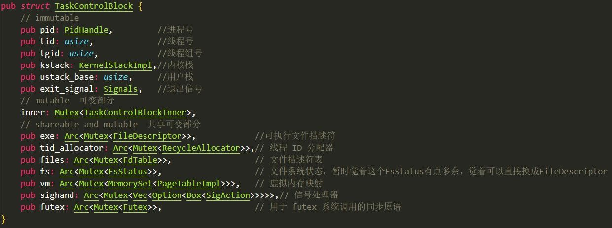
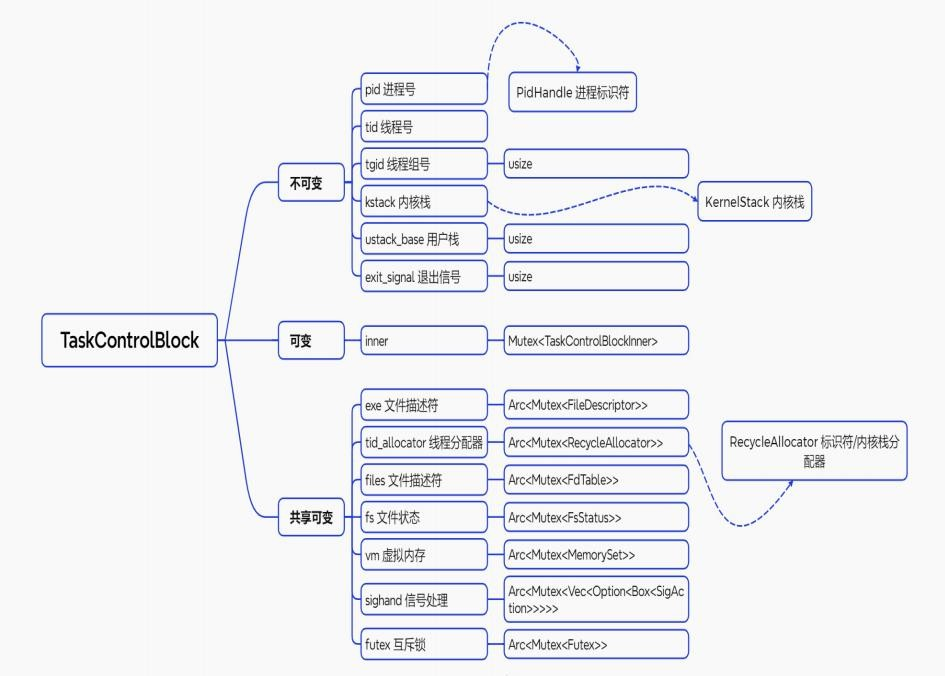
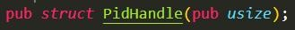
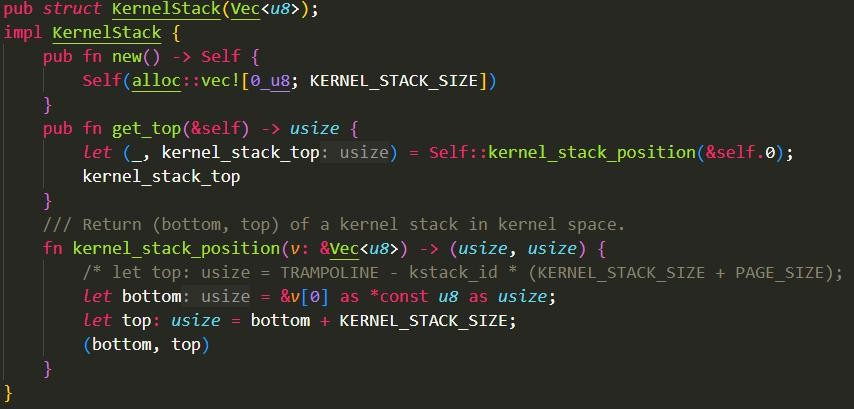

#### **1.1** 进程管理

进程管理模块主要功能有：进程初始化、进程载入和解析、进程切换、进程状态构建模块。下面分别介绍。

##### 1.1.1 进程控制块

进程指的是在系统中运行的一个程序的实例。而进程的生命周期包括从创建，就绪，阻塞，运行中，退出。在一个进程被创建之后，他会进入NPUcore+中的就绪队列，在被操作系统调度之后将会进入到运行状态。在运行状态下时间片耗尽或者是主动让出CPU的时候，进程会进入到就绪队列中，等待下一次被调度。在运行的时候调用诸如wait等系统调用，进程会进入到阻塞队列中，等待被唤醒。当进程执行结束，他会退出，释放系统资源。

在 NPUcore+ 中，我们使用 TCB结构体来描述一个进程，该结构体可以完整地描述一个进程的内容和结构。利用该结构体，我们可以像linux 一样使用进程来模拟线程。这与 windows操作系统的设计思路是不同的，其线程的实现依靠单独的一套thread\_control\_block完成。

因此线程在 NPUcore+ 中的理解变为了这样——一个可以与同线程组(tg1d 共享内存空间的进程即为线程。

进程控制包括进程的创建、结束和信号处理。

-   exit: 结束调用它的进程。

-   exit\_group: 结束与调用进程相同进程组的所有进程。

-   kill: 向指定进程发送信号。

-   tkill: 向指定线程发送信号。

-   clone: 创建一个新进程，是 Linux 线程创建的基础。

-   execve: 在当前进程中加载并运行一个新程序。

-   wait4: 等待进程状态发生变化。

-   setpgid: 设置进程组 ID。

-   getpgid: 获取指定进程的进程组 ID。

管理进程时，NPUcore+ 使用了 TCB 的数据结构，不同于传统的 PCB 数据结构，NPUcore+ 将线程视为共享栈的进程。TCB 的数据结构如下：

>  

在上面的定义中，我们可以看到 TCB 中包含了进程的进程号，线程号，线程组号，内核栈，用户栈，退出信号以及一些共享的资源。后面将具体讲解如何管理这些资源以及进程之间的调度。

在 NPUcore+ 中，任务控制块 TCB(Task Control Block) 将直接作为 PCB进行使用。

下图是 NPUcore+ 中进程控制块的具体组成。

>  

##### 1.1.2 进程管理重要数据结构

\(1) 进程标识符PidHandle

同一时间存在的所有进程都有一个唯一的进程标识符，将其抽象为PidHandle 类型。

>  

进程标识符是一个 64 位的无符号整数，用来标识进程ID。进程标识符的分配和回收由标识符分配器 RecycleAllocator完成。我们一般简称其为 PID。

\(2) 内核栈 KernelStack

内核在创建进程的时候，在创建 task\_struct 的同时，会为进程创建两个栈，第一个栈也就是上面分析到的进程用户栈，存在于用户空间使用，另外还有一个内核栈，存放在内核空间。

内核栈存在的意义：如系统调用在陷入内核后，系统调用中也是存在函数调用和自动变量，这些都需要栈支持。

每个进程都要有独自的内核栈的必要性：所有进程在运行时，都有可能通过系统调用陷入内核态继续执行，假设第一个进程陷入内核执行的时候，需要等待某个资源，主动schedule() ，让出 CPU，第二个进程假设也通过系统调用进入了内核态，如果进程共享内核栈，那么第二个进程在系统调用压栈时会破坏第一个进程栈数据。

每个应用都有自己的内核栈，因此 KernelStack 的内部就是其所属进程的PID 号。

>  
