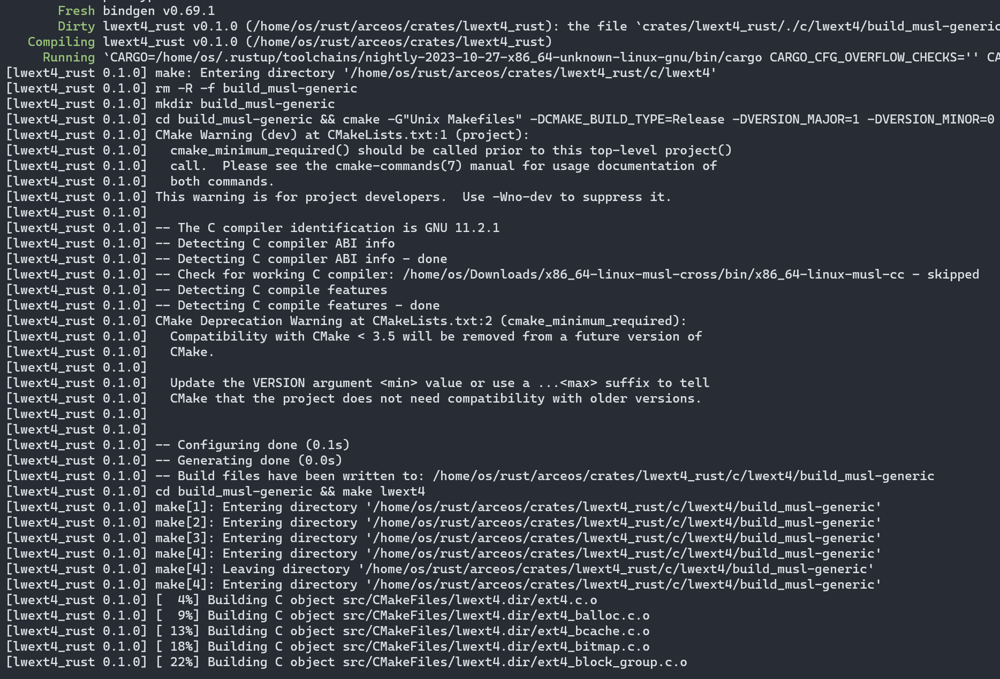

# Rust支持Ext4文件系统技术文档

## 概述
为了给Rust操作系统，提供通用的独立的Ext4文件系统库，开发了[lwext4_rust](https://github.com/elliott10/lwext4_rust.git)

lwext4_rust 库是基于[lwext4](https://github.com/gkostka/lwext4.git)库，将其C语言接口抽象为 Rust 语言。

lwext4 则是用于嵌入式的 C 语言 ext2/ext3/ext4 文件系统库。

## 总体技术设计

为了能将lwext4_rust库应用于各种Rust OS，对所有Ext4块设备及文件的接口进行了封装抽象，并做到无特定操作系统依赖，创建了独立的crate库，代码仓库放置于Github。


#### lwext4_rust库当前已经支持的特性：
* 基于Rust对多种架构进行了支持： x86_64, riscv64 以及aarch64等；
* 支持文件类型包括：常规文件，目录，软链接，FIFO，字符设备，块设备，Socket等；
* 支持文件的读写执行等权限
* Journal日志事务及恢复功能；
* block cache的内存缓存；


#### lwext4_rust库当前的依赖：
* 在Rust OS上，依赖libc的支持；
* Rust开发环境；
* 基于musl libc的交叉编译工具


### lwext4_rust库的自动化编译

lwext4_rust库，包括了C语言代码，也包括了从C到Rust生成的接口，以及Rust实现的代码。

首先，为了支持对C语言lwext4库的编译，需要修改源码中的 Makefile 及 cmake

添加编译的目标，以及添加调试LOG的打印输出等。

``` diff
+ add_definitions(-DCONFIG_DEBUG_PRINTF=1)

+ -DLWEXT4_BUILD_SHARED_LIB=OFF \
+ -DCMAKE_INSTALL_PREFIX=./install \
```

同时必须创建用于Rust环境的基于musl的cmake交叉编译文件，包括选用适当的编译flags参数，去除默认系统的stdlib标准库等。

``` diff
+ set(LD_FLAGS "-nolibc -nostdlib -static -no-pie --gc-sections -nostartfiles")
```

在Rust Cargo lib层面，则构建编译脚本`build.rs`.
编译脚本实现了通过git自动同步仓库，自动对C语言库打patch，以及根据不同架构选择相应的make编译器。
后通过执行make命令，生成需要的静态库`liblwext4.a`.

#### 从C生成Rust bindings接口

将C语言接口用于Rust语言，其中很重要的一步，需要把C的头文件中定义的函数接口，转换成Rust语言可调用的函数接口。

这里会用到工具`bindgen`

当C语言库编译通过的情况下，已经满足了头文件之间的依赖，则可以

通过`bindgen`，自动地将C头文件中的函数接口，这里放置于`wrapper.h`,

生成Rust语言对应函数、结构体等的定义, 这里放置于`bindings.rs`

如下为生成Rust bindings接口的是编译脚本实现。

``` rust
fn generates_bindings_to_rust() {
    let bindings = bindgen::Builder::default()
        .use_core()
        // The input header we would like to generate bindings for.
        .header("c/wrapper.h")
        .clang_arg("-I../../ulib/axlibc/include")
        .clang_arg("-I./c/lwext4/include")
        .clang_arg("-I./c/lwext4/build_musl-generic/include/")
        .layout_tests(false)
        .parse_callbacks(Box::new(bindgen::CargoCallbacks::new()))
        // Finish the builder and generate the bindings.
        .generate()
        .expect("Unable to generate bindings");

    // Write the bindings to the $OUT_DIR/bindings.rs file.
    let out_path = PathBuf::from("src");
    bindings
        .write_to_file(out_path.join("bindings.rs"))
        .expect("Couldn't write bindings!");
}
```

lwext4_rust库的编译过程，包括了Rust代码的编译，以及C代码的编译。如下图：




由于lwext4_rust库依赖libc的实现，如`axlibc`，对`malloc`, `fprintf`, `strncmp` 等库函数的实现。

这里以ArceOS的`axlibc`的libc库为例，将libc引用到编译中。

在编译脚本中添加，添加了依赖库的链接。

```
cargo:rustc-link-search=native=ulib/axlibc/
cargo:rustc-link-lib=static=c
```

默认的`axlibc`只编译成`.a`静态库，给C类应用提供libc库的支持。

当使用Rust应用时，则需要以rust lib的形式编译链接进来；
故修改Cargo.toml，同时生成多种类型的库。

``` diff
[lib]
- crate-type = ["staticlib"]
+ crate-type = ["lib", "staticlib"]
```

对于C库与Rust库的共同链接过程，通过将生成的多种`.a`，最后链接到同一个elf文件中，如下图：

``` sh
rust-lld -flavor gnu -nostdlib -static -no-pie --gc-sections \
 -Tmodules/axhal/linker_x86_64-qemu-q35.lds --no-relax \
 ulib/axlibc/build_x86_64/libc.a \
 target/x86_64-unknown-none/debug/libaxlibc.a \
 apps/c/helloworld/main.o -o apps/c/helloworld/helloworld_x86_64-qemu-q35.elf
```

### 磁盘操作接口代码实现

磁盘操作接口，是供操作系统调用的文件系统接口。

在lwext4_rust库中，是实现的代码结构：`blockdev::Ext4BlockWrapper`

Ext4BlockWrapper 结构包括了对 ext4 块设备的初始化。

以及通过rust的结构，填充C的结构体的成员内容，其中包括：缓存构建，磁盘操作接口的回调函数：write， read， seek， flush

`blockdev::Ext4BlockWrapper`需要可以向下操作块设备，包括ext4 block device的所有操作接口函数，包括：创建、注册、状态获取、挂载mount, open, read, write, seek等操作。

#### 非OS依赖的独立crate库

在设计非Rust OS依赖的独立的crate库时，对于接口的抽象等，也许需要思考的一些问题。

接口结构体如何设计 ？

首先，对于lwext4_rust的磁盘操作接口，调用过程如下：

`C代码` --> `lwext4_rust` --> `Rust OS 组件的接口`

为了实现与C代码的相互调用，对C语言的函数接口进行了转换。

原C代码函数接口：


转换成Rust函数：
``` rust
extern "C" {
    #[doc = "@brief   File seek operation.\n\n
	@param   file File handle.\n
	@param   offset Offset to seek.\n
	@param   origin Seek type:\n
	            @ref SEEK_SET\n
				@ref SEEK_CUR\n
				@ref SEEK_END\n\n
				@return  Standard error code."]
    pub fn ext4_fseek(file: *mut ext4_file, offset: i64, origin: u32) -> c_int;
}
```

Rust OS 组件的接口，如磁盘操作相关的结构体及方法 `Disk`

为了让crate相对独立，不直接依赖RustOS组件结构，需要抽象一个`trait KernelDevOp` 接口

定义好抽象的Rust trait磁盘操作接口，以供操作系统层面去实现。

``` rust
pub trait KernelDevOp {
    type DevType;

    fn write(dev: &mut Self::DevType, buf: &[u8]) -> Result<usize, i32>;
    fn read(dev: &mut Self::DevType, buf: &mut [u8]) -> Result<usize, i32>;
    fn seek(dev: &mut Self::DevType, off: i64, whence: i32) -> Result<i64, i32>;
    fn flush(dev: &mut Self::DevType) -> Result<usize, i32> where Self: Sized;
}

impl<K: KernelDevOp> Ext4BlockWrapper<K>
...
```
接下来，

如何通过trait的方法接口，调用到磁盘操作相关的Disk数据结构的实例呢？

第一种，最常用的是通过self, 把实例化的结构体, 以结构体变量, 或函数参数的方式传入；

第二种，创建`全局static变量`的方式, 可以妥善保存下来以备调用。

还有一种，则是通过downcast方式，将dyn trait类型，转换成具体Disk结构体的实例。但是需要引入操作系统Disk的定义，从而导致引入了操作系统的依赖。

lwext4_rust库，


其中C语言库，需要调用Rust实现的回调函数，该函数限制了函数的参数输入与返回值。

如使用了固定的结构体裸指针及通用类型数据。
``` rust
fn(*mut ext4_blockdev, *const c_void, u64, u32) -> i32
```

这里需要创建不能以`self`为第一参数的关联函数`Ext4BlockWrapper::dev_bwrite()`

结构体实例的引用的问题，没办法在关联函数中直接调用磁盘操作接口Disk。

可以通过全局static变量，或将磁盘操作结构体Disk，存入的C 结构体变量中；

以及，通过在trait，定义type DevType，以保存磁盘操作结构体类型Disk。

#### 所有权问题

在Rust与C交互调用的过程，结构体及变量等的所有权问题需要特别注意。

例如，对将要传入C函数的字符串，需要进行处理。

通过`into_raw`消耗 CString 并将字符串的所有权转移给 C 调用者， 最后转换成裸指针，供C代码调用。

这里

调用完后，通过`from_raw`收回被传输到 C 语言的 CString 的所有权。

CString::from_raw 可以收回所有权，并自动销毁变量；

通过Rust drop掉变量内存。

``` rust
	let c_path = CString::new(path).expect("CString::new failed");
	let c_path = c_path.into_raw();

	// fn ext4_fopen(file: *mut ext4_file, path: *const c_char, flags: *const c_char) -> c_int
	unsafe { ext4_fopen(&mut self.file_desc, c_path, flags) };
	
	...
	drop(CString::from_raw(c_path));
``````

若没有妥善处理Rust重要结构体实例的所有权，有可能导致运行崩溃。

例如，当在磁盘设备操作的open中，对传入的保存在Box中的磁盘设备结构体，未妥善处理所有权问题时。

出现了该磁盘设备结构体丢失，后导致程序崩溃


这里，`Box::into_raw`消耗Box，返回一个包装的裸指针。指针将正确对齐且非空。

调用into_raw函数后，调用者要对之前由 Box 管理的内存负责。这里的调用者是C语言代码。
特别是，调用者应适当销毁 T 并释放内存，同时考虑到 Box 使用的内存布局。最简单的方法是使用 `Box::from_raw` 函数将原始指针转换回Box，然后让Box析构函数执行清理。

当然，为了规避所有权问题，可以使用借用`&`, 同时借用也能方便地转换成裸指针。

如ext4_fopen的参数，将`&mut file_desc`转换成了`*mut ext4_file`裸指针类型。
 

再说一件事， One more thing

C语言与Rust语言对字符串的对待，存在区别。

C语言的字符串结尾多一个`\0`


### 文件操作接口代码实现

这里以ArceOS系统为例，通过分析ArceOS系统中，文件系统的调用流程：

`C App Open a file` ->

-> `ulib/axlibc/src/fs.rs`

-> `api/arceos_posix_api/src/imp/fs.rs`

-> `modules/axfs/src/fops.rs`

-> `axfs_vfs/src/lib.rs::<trait VfsOps, trait VfsNodeOps>`

-> `modules/axfs/src/fs/ext4fs`

-> `lwext4_rust::<Ext4BlockWrapper, Ext4File>`

梳理了现有文件系统相关的组件结构

实现Ext4FileSystem作为文件系统的实例，并作为操作系统对文件系统的操作对象；

实现文件系统设备操作接口`impl VfsOps for Ext4FileSystem`，包括挂载，获取根目录等操作；

Ext4FileSystem将初始化并封装 `Ext4BlockWrapper`，该结构将初始化磁盘操作结构Disk，以及将其封装。

对于磁盘操作结构Disk，需要实现`impl KernelDevOp for Disk`，以供文件系统层调用读写找等操作。

以及， 将其实现文件操作接口`impl VfsNodeOps for FileWrapper`，封装了`file::Ext4File`，实现对文件的创建，删除，查找，文件内容的读与写等操作；
对trait VfsNodeOps的实现实例，Ext4FileSystem封装之，并将作为root根文件系统的操作结构。

### 运行起来

先尝试一下Rust对C的调用，显示C的输出。试验基本函数调用过程，确保从内核Rust代码到C库代码，函数调用过程可以走通。


初步实现实现功能包括：ext4磁盘的挂载，卸载，Journal日志功能，bcache功能，多种文件类型枚举，正常操作Read & Write


## Ext4 接口设计

### Ext4 上层高级操作
上层操作包括：文件、目录、挂载点 等。使用时只需包含`ext4.h`头文件。


#### 文件描述符 FILE DESCRIPTOR
结构包含了：挂载点手柄， 文件inode号，打开flags， 文件尺寸，实际文件位点。
```
/**@brief   File descriptor. */
typedef struct ext4_file {

	/**@brief   Mount point handle.*/
	struct ext4_mountpoint *mp;

	/**@brief   File inode id.*/
	uint32_t inode;

	/**@brief   Open flags.*/
	uint32_t flags;

	/**@brief   File size.*/
	uint64_t fsize;

	/**@brief   Actual file position.*/
	uint64_t fpos;
} ext4_file;

```
#### 目录描述符 DIRECTORY DESCRIPTOR

包含了目录描述符，及目录的条目描述符。目录描述符包含了文件描述符，当前目录条目，下个条目的偏移。

```
/**@brief   Directory entry descriptor. */
typedef struct ext4_direntry {
	uint32_t inode;
	uint16_t entry_length;
	uint8_t name_length;
	uint8_t inode_type;
	uint8_t name[255];
} ext4_direntry;

/**@brief   Directory descriptor. */
typedef struct ext4_dir {
	/**@brief   File descriptor.*/
	ext4_file f;
	/**@brief   Current directory entry.*/
	ext4_direntry de;
	/**@brief   Next entry offset.*/
	uint64_t next_off;
} ext4_dir;
```

#### 挂载操作 MOUNT OPERATIONS

- `int ext4_device_register(struct ext4_blockdev *bd, const char *dev_name); `

	函数功能：注册块设备。
	
	参数包括块设备，及块设备名称。返回值是标准错误代码。

- `int ext4_device_unregister(const char *dev_name);`

	函数功能：解除注册的块设备。
	
	参数传入块设备。

- `int ext4_device_unregister_all(void);`

	函数功能：解除注册的所有的块设备。

- `int ext4_mount(const char *dev_name, const char *mount_point, bool read_only);`

	函数功能：挂载一个带有EXT4分区的块设备到指定挂载点。

	参数包括块设备名称，参考注册块设备时的名称，挂载点，挂载只读模式。返回值是标准错误代码。
挂载点，例如：
	- `/`
	- `/my_partition/`
	- `/my_second_partition/`

- `int ext4_umount(const char *mount_point);`

	函数功能：对挂载点进行卸载操作。
	
	参数传入挂载点。

- `int ext4_journal_start(const char *mount_point);`

	函数功能：开始记录journal日志。journal日志的启动/停止功能对使用来讲是透明的。可以在无journal日志记录支持的文件系统上使用。

	参数传入挂载点。返回值是标准错误代码。

	用法：
	```
  ext4_mount("sda1", "/");
  ext4_journal_start("/");

  //在这期间进行文件的操作...

  ext4_journal_stop("/");
  ext4_umount("/");
	```

- `int ext4_journal_stop(const char *mount_point);`

	函数功能：停止记录journal日志。journal日志的启动/功能对使用来讲是透明的。可以在无journal日志记录支持的文件系统上使用。
	
	参数传入挂载点。返回值是标准错误代码。


- `int ext4_recover(const char *mount_point);`

	函数功能：停止记录journal日志。 必须在`ext4_mount`函数之后被调用。
	
	参数传入挂载点。返回值是标准错误代码。

结构用于统计一些挂载的文件系统的统计数据
```
struct ext4_mount_stats {
	uint32_t inodes_count;
	uint32_t free_inodes_count;
	uint64_t blocks_count;
	uint64_t free_blocks_count;

	uint32_t block_size;
	uint32_t block_group_count;
	uint32_t blocks_per_group;
	uint32_t inodes_per_group;

	char volume_name[16];
};
```


- `int ext4_mount_point_stats(const char *mount_point, struct ext4_mount_stats *stats);`

	函数功能：获取文件挂载点统计信息。
	
	参数传入挂载点，文件系统统计信息的结构。返回值是标准错误代码。


- `int ext4_mount_setup_locks(const char *mount_point, const struct ext4_lock *locks);`

	函数功能：设置操作系统的常规锁。
	
	参数传入挂载点，加锁与解锁函数的结构。返回值是标准错误代码。


- `int ext4_get_sblock(const char *mount_point, struct ext4_sblock **sb);`

	函数功能： 获取一个文件系统挂载点的Superblock超级块指针。
	
	参数包括挂载点，超级块手柄。返回值是标准错误代码。

- `int ext4_cache_write_back(const char *path, bool on);`

	函数功能：Cache 缓存写回模式的开启与关闭。
	
	参数传入挂载点，1开启/0关闭 缓存写回模式。返回值是标准错误代码。

	用法：
	
	默认的缓存模型是写透。这意味着当您执行以下操作时：
	```
          ext4_fopen(...);
          ext4_fwrite(...);
                           < --- 数据被刷新到物理驱动器

          当您执行操作:
          ext4_cache_write_back(..., 1);
          ext4_fopen(...);
          ext4_fwrite(...);
                           < --- 数据`不`被刷新到物理驱动器

          ext4_cache_write_back(..., 0);
                           < --- 当禁用写回模式时，所有缓存数据将被刷新到物理驱动器。
	```
 	要永久地启用写回模式，只需在`ext4_mount`之后调用此函数一次,并在`ext4_umount`之前禁用。

 	一些函数在内部使用缓存写回模式。
 	如果您两次启用写回模式，那么您必须两次禁用它才能刷新所有数据：
	```
      ext4_cache_write_back(..., 1);
      ext4_cache_write_back(..., 1);

      ext4_cache_write_back(..., 0);
      ext4_cache_write_back(..., 0);
	```
	写回模式在您想要创建大量空文件/目录时非常有用。


- `int ext4_cache_flush(const char *path);`

	函数功能：用力刷新 Cache 缓存。
	
	参数传入挂载点。返回值是标准错误代码。

#### 操作系统的LOCK锁接口
操作系统依赖的锁接口。结构包括：对挂载点的访问进行加锁与解锁的函数指针。

```
/**@brief   OS dependent lock interface.*/
struct ext4_lock {
	/**@brief   Lock access to mount point.*/
	void (*lock)(void);
	/**@brief   Unlock access to mount point.*/
	void (*unlock)(void);
};
```

#### 文件操作

- `int ext4_fremove(const char *path);`

	函数功能：按路径删除文件。
	
	参数传入文件路径。返回值是标准错误代码。

- `int ext4_flink(const char *path, const char *hardlink_path);`

	函数功能：为文件创建硬链接。
	
	参数传入文件路径以及硬链接路径。返回值是标准错误代码。


- `int ext4_frename(const char *path, const char *new_path);`
	
	函数功能：重命名文件。
	
	参数传入原文件路径以及新的目标路径。返回值是标准错误代码。

- `int ext4_fopen(ext4_file *file, const char *path, const char *flags);`
	
	函数功能：文件打开功能。
	
	参数包括：文件手柄，文件路径， 文件打开flags。返回值是标准错误代码。

	其中，打开的文件路径，必须以挂载点开头：`/my_partition/file`;
	文件打开的flags，如下表格：

	| flags字符串 | 打开标志 |
	|--------------------------|-------------------------------------|
	|   r or rb                | O_RDONLY                            |
	|   w or wb                | O_WRONLY|O_CREAT|O_TRUNC            |
	|   a or ab                | O_WRONLY|O_CREAT|O_APPEND           |
	|   r+ or rb+ or r+b       | O_RDWR                              |
	|   w+ or wb+ or w+b       | O_RDWR|O_CREAT|O_TRUNC              |
	|   a+ or ab+ or a+b       | O_RDWR|O_CREAT|O_APPEND             |


- `int ext4_fopen2(ext4_file *file, const char *path, int flags);`
	
	函数功能：替补的文件打开函数。
	
	参数包括：文件句柄，文件路径，必须从挂载点开头：`/my_partition/file`, 文件打开flags标志。返回值是标准错误代码。

- `int ext4_fclose(ext4_file *file);`

	函数功能：
	文件关闭函数。
	
	参数传入文件句柄。返回值是标准错误代码。

- `int ext4_ftruncate(ext4_file *file, uint64_t size);`
	
	函数功能：
	文件截断函数。
	
	参数传入文件句柄和新文件大小。返回值是标准错误代码。

- `int ext4_fread(ext4_file *file, void *buf, size_t size, size_t *rcnt);`
	
	函数功能：
	从文件中读取数据。函数返回标准错误码。

	参数传入：
	- file 文件句柄。
	- buf 输出缓冲区。
	- size 要读取的字节数。
	- rcnt 读取的字节数（允许 NULL）。

	

- `int ext4_fwrite(ext4_file *file, const void *buf, size_t size, size_t *wcnt);`
	
	函数功能：
	将数据写入文件。函数返回标准错误码。

	参数传入：
	- file 文件句柄。
	- buf 要写入的数据
	- size 写入长度..
	- wcnt 写入的字节数（允许 NULL）


- `int ext4_fseek(ext4_file *file, int64_t offset, uint32_t origin);`
	
	函数功能：
	文件查找操作。函数返回标准错误码。

	参数传入：
 	- file 文件句柄。
 	- offset 要查找的偏移量。
 	- origin 查找类型：
		- SEEK_SET
		- SEEK_CUR
		- SEEK_END


- `uint64_t ext4_ftell(ext4_file *file);`
	
	函数功能：
	获取文件位置。
	
	参数传入文件句柄。函数返回实际文件位置。


- `uint64_t ext4_fsize(ext4_file *file);`
	
	函数功能：
	获取文件大小。函数返回文件大小。

	参数传入文件句柄。

- `int ext4_raw_inode_fill(const char *path, uint32_t *ret_ino, struct ext4_inode *inode);`
	
	函数功能：
	获取文件/目录/链接的 inode。函数返回标准错误码。

	参数传入：
 		- path  文件/目录/链接的路径。
 		- ret_ino 索引节点号。
 		- inode Inode 内部结构。

- `int ext4_inode_exist(const char *path, int type);`
	
	函数功能：
	检查inode是否存在。
	函数返回标准错误码。

	参数传入：
	文件/目录/链接的路径，inode索引节点类型。

	其中，inode类型包括：
	- EXT4_DIRENTRY_UNKNOWN
	- EXT4_DE_REG_FILE
	- EXT4_DE_DIR
	- EXT4_DE_CHRDEV
	- EXT4_DE_BLKDEV
	- EXT4_DE_FIFO
	- EXT4_DE_SOCK
	- EXT4_DE_SYMLINK

- `int ext4_mode_set(const char *path, uint32_t mode);`
	
	函数功能：
	更改文件/目录/链接模式位。
	函数返回标准错误码。

	参数传入：
	- path 文件/目录/链接的路径。
	- mode 新模式位（例如 0777）。

- `int ext4_mode_get(const char *path, uint32_t *mode);`
	
	函数功能：
	获取文件/目录/链接模式位。
	函数返回标准错误码。

	参数传入：
	- path 文件/目录/链接的路径。
	- mode 新模式位（例如 0777）。

- `int ext4_owner_set(const char *path, uint32_t uid, uint32_t gid);`
	
	函数功能：
	更改文件所有者和组。
	函数返回标准错误码。

	参数传入：
	- path 文件/目录/链接的路径。
	- uid 用户 ID。
	- gid 组 ID。

- `int ext4_owner_get(const char *path, uint32_t *uid, uint32_t *gid);`
	
	函数功能：
	获取文件/目录/链接所有者和组。
	函数返回标准错误码。

	参数传入：
 	- path 文件/目录/链接的路径。
 	- uid 用户 ID。
 	- gid 组 ID。

- `int ext4_atime_set(const char *path, uint32_t atime);`

	函数功能：
	设置文件/目录/链接访问时间。
	函数返回标准错误码。

	参数传入：
 	- path 文件/目录/链接的路径。
 	- atime 访问时间戳。

- `int ext4_mtime_set(const char *path, uint32_t mtime);`

	函数功能：
	设置文件/目录/链接修改时间。
	函数返回标准错误码。

	参数传入：
	- path 文件/目录/链接的路径。
	- mtime 修改时间戳。

- `int ext4_ctime_set(const char *path, uint32_t ctime);`

	函数功能：
	设置文件/目录/链接更改时间。
	函数返回标准错误码。

	参数传入：
	- path 文件/目录/链接的路径。
	- ctime 更改时间戳。

- `int ext4_atime_get(const char *path, uint32_t *atime);`

	函数功能：
	获取文件/目录/链接访问时间。
	函数返回标准错误码。

	参数传入：
	- path 文件/目录/链接的路径。
	- atime 访问时间戳。

- `int ext4_mtime_get(const char *path, uint32_t *mtime);`

	函数功能：
	获取文件/目录/链接修改时间。
	函数返回标准错误码。

	参数传入：
	- path 文件/目录/链接的路径。
	- mtime 修改时间戳。

- `int ext4_ctime_get(const char *path, uint32_t *ctime);`

	函数功能：
	获取文件/目录/链接更改时间。
	函数返回标准错误码。

	参数传入：
	- path 文件/目录/链接的路径。
	- ctime 更改时间戳。

- `int ext4_fsymlink(const char *target，const char *path);`

	函数功能：
	创建符号链接。
	函数返回标准错误码。

	参数传入：
	- target 目标条目路径。
	- path 源入口路径。

- `int ext4_mknod(const char *path, int filetype, uint32_t dev);`

	函数功能：
	创建特殊文件。
	函数返回标准错误码。
	参数传入：
	- path 新特殊文件的路径。
	- filetype 新特殊文件的文件类型。不能是常规文件、目录或未知类型。
	- dev 如果文件类型是字符设备或块设备，设备号将成为 inode 中的有效负载。

- `int ext4_readlink(const char *path, char *buf, size_t bufsize, size_t *rcnt);`

	函数功能：
	读取符号链接有效负载。
	函数返回标准错误码。

	参数传入：
	- path 符号链接的路径。
	- buf 输出缓冲区。
	- bufsize 输出缓冲区最大大小。
	- rcnt 读取的字节数。

- `int ext4_setxattr(const char *path, const char *name, size_t name_len, const void *data, size_t data_size);`

	函数功能：
	设置扩展属性。
	函数返回标准错误码。

	参数传入：
	- path 文件/目录的路径
	- name 要添加的条目的名称。
	- name_len @name 的长度（以字节为单位）。
	- data 要添加的条目的数据。
	- data_size 要添加的数据大小。

- `int ext4_getxattr(const char *path, const char *name, size_t name_len, void *buf, size_t buf_size, size_t *data_size);`

	函数功能：
	获取扩展属性。
	函数返回标准错误码。

	参数传入：
	- path 文件/目录的路径。
	- name 要获取的条目的名称。
	- name_len @name 的长度（以字节为单位）。
	- buf 要获取的条目的数据。
	- buf_size 要获取的数据大小。

- `int ext4_listxattr(const char *path, char *list, size_t size, size_t *ret_size);`

	函数功能：
	列出扩展属性。
	函数返回标准错误码。

	参数传入：
	- path 文件/目录的路径。
	- list 保存条目名称的列表。
	- size 列表的大小（以字节为单位）。
	- ret_size 列表的已用字节数。


- `int ext4_removexattr(const char *path, const char *name, size_t name_len);`

	函数功能：
	删除扩展属性。
	函数返回标准错误码。
	
	参数传入：
	- path 文件/目录的路径。
	- name 要删除的条目的名称。
	- name_len @name 的长度（以字节为单位）。

#### 目录操作

- `int ext4_dir_rm(const char *path);`

	函数功能：
	递归目录删除。
	函数返回标准错误码。

	参数传入：
	path 要删除的目录路径

- `int ext4_dir_mv(const char *path, const char *new_path);`
	
	函数功能：
	重命名/移动目录。
	函数返回标准错误码。

	参数传入：
	- path 源路径。
	- new_path 目标路径。
	

- `int ext4_dir_mk(const char *path);`

	函数功能：
	创建新目录。
	函数返回标准错误码。

	参数传入：path 目录名称。
	
- `int ext4_dir_open(ext4_dir *dir, const char *path);`

	函数功能：
	目录打开。
	函数返回标准错误码。

	参数传入：
	- dir 目录句柄。
	- path 目录路径。

- `int ext4_dir_close(ext4_dir *dir);`

	函数功能：
	目录关闭。
	函数返回标准错误码。

	参数传入：dir 目录句柄。
	

- `const ext4_direntry *ext4_dir_entry_next(ext4_dir *dir);`

	函数功能：
	返回下一个目录条目。
	函数返回目录条目id（如果没有条目则为NULL）。

	参数传入：dir 目录句柄。
	

- `void ext4_dir_entry_rewind(ext4_dir *dir);`

	函数功能：
	重制目录条目偏移量。
	函数无返回值。

	参数传入： dir 目录句柄。
	


#### 块设备模块

   块设备的操作接口函数主要定义在`ext4_blockdev.h`

<!--
```
struct ext4_blockdev_iface {
	/**@brief   Open device function
	 * @param   bdev block device.*/
	int (*open)(struct ext4_blockdev *bdev);

	/**@brief   Block read function.
	 * @param   bdev block device
	 * @param   buf output buffer
	 * @param   blk_id block id
	 * @param   blk_cnt block count*/
	int (*bread)(struct ext4_blockdev *bdev, void *buf, uint64_t blk_id,
		     uint32_t blk_cnt);

	/**@brief   Block write function.
	 * @param   buf input buffer
	 * @param   blk_id block id
	 * @param   blk_cnt block count*/
	int (*bwrite)(struct ext4_blockdev *bdev, const void *buf,
		      uint64_t blk_id, uint32_t blk_cnt);

	/**@brief   Close device function.
	 * @param   bdev block device.*/
	int (*close)(struct ext4_blockdev *bdev);

	/**@brief   Lock block device. Required in multi partition mode
	 *          operations. Not mandatory field.
	 * @param   bdev block device.*/
	int (*lock)(struct ext4_blockdev *bdev);

	/**@brief   Unlock block device. Required in multi partition mode
	 *          operations. Not mandatory field.
	 * @param   bdev block device.*/
	int (*unlock)(struct ext4_blockdev *bdev);

	/**@brief   Block size (bytes): physical*/
	uint32_t ph_bsize;

	/**@brief   Block count: physical*/
	uint64_t ph_bcnt;

	/**@brief   Block size buffer: physical*/
	uint8_t *ph_bbuf;

	/**@brief   Reference counter to block device interface*/
	uint32_t ph_refctr;

	/**@brief   Physical read counter*/
	uint32_t bread_ctr;

	/**@brief   Physical write counter*/
	uint32_t bwrite_ctr;

	/**@brief   User data pointer*/
	void* p_user;
};
```

```
/**@brief   Definition of the simple block device.*/
struct ext4_blockdev {
	/**@brief Block device interface*/
	struct ext4_blockdev_iface *bdif;

	/**@brief Offset in bdif. For multi partition mode.*/
	uint64_t part_offset;

	/**@brief Part size in bdif. For multi partition mode.*/
	uint64_t part_size;

	/**@brief   Block cache.*/
	struct ext4_bcache *bc;

	/**@brief   Block size (bytes) logical*/
	uint32_t lg_bsize;

	/**@brief   Block count: logical*/
	uint64_t lg_bcnt;

	/**@brief   Cache write back mode reference counter*/
	uint32_t cache_write_back;

	/**@brief   The filesystem this block device belongs to. */
	struct ext4_fs *fs;

	void *journal;
};
```

```
/**@brief   Static initialization of the block device.*/
#define EXT4_BLOCKDEV_STATIC_INSTANCE(__name, __bsize, __bcnt, __open, __bread,\
				      __bwrite, __close, __lock, __unlock)     \
	static uint8_t __name##_ph_bbuf[(__bsize)];                            \
	static struct ext4_blockdev_iface __name##_iface = {                   \
		.open = __open,                                                \
		.bread = __bread,                                              \
		.bwrite = __bwrite,                                            \
		.close = __close,                                              \
		.lock = __lock,                                                \
		.unlock = __unlock,                                            \
		.ph_bsize = __bsize,                                           \
		.ph_bcnt = __bcnt,                                             \
		.ph_bbuf = __name##_ph_bbuf,                                   \
	};								       \
	static struct ext4_blockdev __name = {                                 \
		.bdif = &__name##_iface,                                       \
		.part_offset = 0,                                              \
		.part_size =  (__bcnt) * (__bsize),                            \
	}
```

-->

- `int ext4_block_init(struct ext4_blockdev *bdev);`

	函数功能：
	块设备初始化。
	函数返回标准错误码。

	参数传入：bdev 块设备描述符
	

- `int ext4_block_bind_bcache(struct ext4_blockdev *bdev, struct ext4_bcache *bc);`

	函数功能：
	将 block cache 绑定到块设备。
	函数返回标准错误码。

	参数传入：
	- bdev 块设备描述符
	- bc 块缓存描述符
	

- `int ext4_block_fini(struct ext4_blockdev *bdev);`

	函数功能：
	关闭块设备
	函数返回标准错误码。

	参数传入：bdev 块设备描述符
	

- `int ext4_block_flush_buf(struct ext4_blockdev *bdev, struct ext4_buf *buf);`

	函数功能：
	将给定缓冲区中的数据刷新到磁盘。
	函数返回标准错误码。

	参数传入：
	- bdev 块设备描述符
	- buf 缓冲区
	

- `int ext4_block_flush_lba(struct ext4_blockdev *bdev, uint64_t lba);`

	函数功能：
	 将给定 lba 缓冲区中的数据刷新到磁盘，如果该缓冲区存在于块缓存中。
	函数返回标准错误码。

	参数传入：
	- bdev 块设备描述符
	- lba 逻辑块地址
	
- `void ext4_block_set_lb_size(struct ext4_blockdev *bdev, uint32_t lb_bsize);`

	函数功能：
	设置块设备中的逻辑块大小。
	函数返回标准错误码。

	参数传入：
	- bdev 块设备描述符
	- lb_bsize 逻辑块大小（以字节为单位）


- `int ext4_block_get_noread(struct ext4_blockdev *bdev, struct ext4_block *b, uint64_t lba);`

	函数功能：
	块获取函数（通过缓存，不读取）。
	函数返回标准错误码。

	参数传入：
	- b 块描述符
	- lba 逻辑块地址
	- bdev 块设备描述符
	

- `int ext4_block_get(struct ext4_blockdev *bdev, struct ext4_block *b, uint64_t lba);`

	函数功能：
	块获取函数（通过缓存）。
	函数返回标准错误码。

	参数传入：
	- bdev 块设备描述符
	- b 块描述符
	- lba 逻辑块地址
	

- `int ext4_block_set(struct ext4_blockdev *bdev, struct ext4_block *b);`

	函数功能：
	块设置程序（通过缓存）。
	函数返回标准错误码。

	参数传入：
	- bdev 块设备描述符
	- b 块描述符
	

- `int ext4_blocks_get_direct(struct ext4_blockdev *bdev, void *buf, uint64_t lba, uint32_t cnt);`

	函数功能：
	块读取程序（无缓存）
	函数返回标准错误码。

	参数传入：
	- bdev 块设备描述符
	- buf 输出缓冲区
	- lba 逻辑块地址
	

- `int ext4_blocks_set_direct(struct ext4_blockdev *bdev, const void *buf, uint64_t lba, uint32_t cnt);`

	函数功能：
	块写入程序（无缓存）。
	函数返回标准错误码。

	参数传入：
	- bdev 块设备描述符
	- buf 输出缓冲区
	- lba 逻辑块地址
	
- `int ext4_block_writebytes(struct ext4_blockdev *bdev, uint64_t off, const void *buf, uint32_t len);`

	函数功能：
	写入块设备（通过 direct address）。
	函数返回标准错误码。

	参数传入：
	- bdev 块设备描述符
	- off 块设备中的字节偏移量
	- buf 输入缓冲区
	- len 写入缓冲区的长度
	

- `int ext4_block_readbytes(struct ext4_blockdev *bdev, uint64_t off, void *buf, uint32_t len);`

	函数功能：
	读取块设备（通过 direct address）。
	函数返回标准错误码。

	参数传入：
	- bdev 块设备描述符
	- off 块设备中的字节偏移量
	- buf 输入缓冲区
	- len 写入缓冲区的长度
	

- `int ext4_block_cache_flush(struct ext4_blockdev *bdev);`

	函数功能：
	将所有脏缓冲区刷新到磁盘。
	函数返回标准错误码。

	参数传入：bdev 块设备描述符
	

- `int ext4_block_cache_write_back(struct ext4_blockdev *bdev, uint8_t on_off);`

	函数功能：
	启用/禁用回写缓存模式。
	函数返回标准错误码。

	参数传入：bdev 块设备描述符，on_off 开关。
	其中参数on_off，`!0`表示启用。`0`表示禁用，所有延迟的cache缓冲将被刷新。
	
